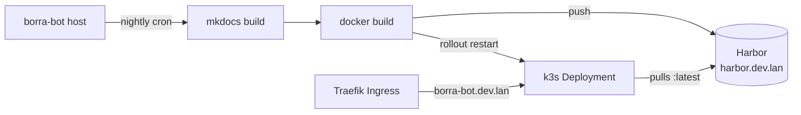

# Deploying the Borra Bot Journal to k3s

A static MkDocs site that publishes Borra Bot's daily journal. Built daily on
the host where the bot runs and served from k3s behind Traefik at
`http://borra-bot.dev.lan`.

## Architecture



- **Build:** runs on the host (not in-cluster) so MkDocs has access to git
  history for the `git-revision-date-localized` plugin timestamps.
- **Image:** `nginxinc/nginx-unprivileged:1.27-alpine` serving pre-built
  static HTML on port 8080. Image fits the `restricted` Pod Security Standard
  out of the box.
- **Tagging:** every build pushes two tags — `:YYYY-MM-DD` (immutable,
  rollback target) and `:latest` (what the Deployment pulls).

## Prerequisites

| Item | Value |
|---|---|
| Cluster | k3s (with default Traefik ingress) |
| Registry | Harbor (`harbor.dev.lan` and `192.168.1.206:30002`) |
| Host running the bot | Has `docker`, `kubectl`, and `uv` installed and authenticated to the cluster + Harbor |
| Source repo | `https://github.com/jcarranz97/borra-bot` cloned on the host, on the branch the cron should track |
| DNS | `borra-bot.dev.lan` resolves to a k3s node (Pi-hole entry or `/etc/hosts`) |

## One-time setup

### 1. Add the hostname to DNS

Either add a Pi-hole local record for `borra-bot.dev.lan` pointing at a node
IP (`192.168.1.206` for the worker, `192.168.1.208` for the control plane),
**or** add a hosts entry on each machine that needs to reach the site:

```text
192.168.1.206  borra-bot.dev.lan
```

### 2. Create the namespace

The deploy script applies this automatically, but it's listed here for
reference (`borra-bot/k8s/namespace.yaml`):

```yaml
apiVersion: v1
kind: Namespace
metadata:
  name: borra-bot-journal
  labels:
    pod-security.kubernetes.io/enforce: restricted
    pod-security.kubernetes.io/enforce-version: latest
```

### 3. Create the Harbor pull secret

The Deployment references `imagePullSecrets: [{name: harbor-secret}]`. Create
it once in the namespace:

```bash
kubectl create namespace borra-bot-journal  # if not already created
kubectl create secret docker-registry harbor-secret \
  --docker-server=harbor.dev.lan \
  --docker-username=<your-harbor-user> \
  --docker-password=<your-harbor-password> \
  --namespace=borra-bot-journal
```

### 4. First deploy

Run the deploy script manually for the first time — it builds, pushes, and
applies everything:

```bash
cd /path/to/borra-bot
./scripts/deploy-journal.sh
```

After it finishes, verify:

```bash
kubectl get pods -n borra-bot-journal
# NAME                                 READY   STATUS    RESTARTS   AGE
# borra-bot-journal-xxxxxxx-yyyyy      1/1     Running   0          30s

curl -I http://borra-bot.dev.lan
# HTTP/1.1 200 OK
```

Open `http://borra-bot.dev.lan` in a browser — you should see the journal
landing page.

## Daily deployment flow

Once everything works manually, schedule the deploy script via cron on the
host where the bot runs. The bot's auto-learn job writes the day's journal
at 23:00 UTC and pushes it to GitHub immediately after; pick a deploy time
that gives that push room to land.

Edit the bot user's crontab:

```bash
crontab -e
```

Add:

```cron
# Borra Bot Journal — daily build & deploy
30 0 * * *  /home/homelab/borra-bot/scripts/deploy-journal.sh >> /var/log/borra-bot-journal-deploy.log 2>&1
```

(Adjust the path to where `borra-bot` is cloned on the host.) That fires at
00:30 UTC daily — ~1.5 hours after auto-learn finishes.

If `/var/log/` is not writable by the cron user, put the log somewhere the
user owns, e.g. `~/borra-bot-journal-deploy.log`.

## What the deploy script does

```bash
git pull --ff-only                           # latest journal entries
uv run mkdocs build                          # produces ./site
docker build -t harbor.dev.lan/library/borra-bot-journal:YYYY-MM-DD \
             -t harbor.dev.lan/library/borra-bot-journal:latest \
             -f docker/Dockerfile .
docker push ...:YYYY-MM-DD
docker push ...:latest
kubectl apply -f k8s/                        # idempotent
kubectl rollout restart deployment/borra-bot-journal -n borra-bot-journal
kubectl rollout status  deployment/borra-bot-journal -n borra-bot-journal --timeout=120s
```

The `:latest` tag is what the Deployment pulls (with
`imagePullPolicy: Always`); the `:YYYY-MM-DD` tag is the immutable rollback
target.

## Rollback

To restore yesterday's site:

```bash
kubectl set image deployment/borra-bot-journal \
  nginx=harbor.dev.lan/library/borra-bot-journal:2026-05-27 \
  -n borra-bot-journal
```

(Substitute the date you want.) `kubectl rollout undo` also works for the
single previous version.

## Manual ops

```bash
# What's running
kubectl get all -n borra-bot-journal

# Pod logs (nginx access + error)
kubectl logs -n borra-bot-journal -l app=borra-bot-journal -f

# Force a rebuild + redeploy outside the cron window
/home/homelab/borra-bot/scripts/deploy-journal.sh

# Check that the ingress is wired up
kubectl get ingress -n borra-bot-journal
# NAME                CLASS     HOSTS                ADDRESS                       PORTS
# borra-bot-journal   traefik   borra-bot.dev.lan    192.168.1.206,192.168.1.208   80
```

## Troubleshooting

### `ImagePullBackOff` on first deploy

Two common causes:

1. **k3s nodes can't reach Harbor over HTTP** — verify each node's
   `/etc/rancher/k3s/registries.yaml` lists `harbor.dev.lan` as an insecure
   mirror. See [Harbor Ingress setup](../services/harbor.md#step-4--trust-harbordevlan-on-every-k3s-node).
2. **Pull secret missing** — `kubectl get secrets -n borra-bot-journal`
   should show `harbor-secret`. If not, re-run the secret creation command
   from step 3 above.

### Cron runs but `borra-bot.dev.lan` shows stale content

The Deployment uses `imagePullPolicy: Always`, so a rollout-restart triggers
a fresh pull. If you suspect Harbor was offline during the build:

```bash
# Confirm the image actually got pushed
kubectl describe pod -n borra-bot-journal -l app=borra-bot-journal | grep Image

# Check Harbor for the tag
docker pull harbor.dev.lan/library/borra-bot-journal:$(date -u +%Y-%m-%d)
```

### Build fails with `mkdocs: command not found`

The cron user's PATH doesn't include the uv venv. The script uses
`uv run mkdocs build` (not bare `mkdocs`), which uses the project's venv —
but `uv` itself still needs to be on PATH. Either install `uv` system-wide
or add it to the crontab line:

```cron
30 0 * * *  PATH=/usr/local/bin:$HOME/.local/bin:$PATH /home/homelab/borra-bot/scripts/deploy-journal.sh ...
```

### `git pull` fails (auth)

If the host clones over HTTPS without credentials, switch to SSH:

```bash
cd /home/homelab/borra-bot
git remote set-url origin git@github.com:jcarranz97/borra-bot.git
```

…and ensure the cron user has a working SSH key for GitHub.

## Tear-down

```bash
kubectl delete namespace borra-bot-journal
# Removes Deployment, Service, Ingress, and the pull secret.

# Drop the crontab entry
crontab -e   # delete the deploy-journal.sh line

# Optionally clean Harbor
# Through the UI: Projects → library → borra-bot-journal → Delete repository
```

## References

- [Harbor Container Registry](../services/harbor.md) — registry URL, pull-secret pattern
- [K8s Harbor HTTP Registry Setup](k8s-harbor-http-registry.md) — node-level config
- [Hermes K8s Deployment](hermes-k8s-deployment.md) — template this guide follows
- Borra Bot repo: <https://github.com/jcarranz97/borra-bot>
