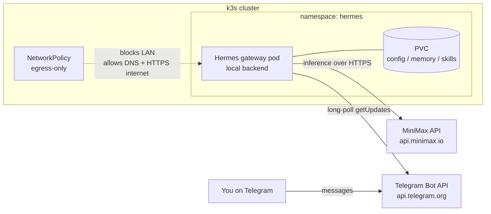

# Running Hermes Agent in k3s (sandboxed, Telegram + MiniMax)

This guide deploys [Hermes Agent](https://github.com/NousResearch/hermes-agent) — Nous Research's
self-improving AI agent — into the homelab k3s cluster as a **Telegram bot** backed by the
**MiniMax** cloud model. You chat with the agent from Telegram on any device; the agent itself
runs locked inside an isolated namespace.

The goal is **isolation**. Hermes autonomously executes shell commands and writes its own
"skills" to disk. Running it in a hardened, network-restricted pod keeps that activity inside a
disposable container instead of on a personal machine: if the agent misbehaves, you delete the
pod and redeploy.

## Why this shape works for isolation

Two design choices keep the blast radius small:

- **Telegram long-polling, not webhooks.** The gateway reaches *out* to `api.telegram.org` to
  fetch messages — it never accepts an inbound connection. So the pod needs **no Ingress, no
  exposed port, no LoadBalancer**. You talk to it through Telegram's cloud, not through the
  cluster network.
- **MiniMax is a cloud API.** Inference leaves the pod over plain HTTPS to `api.minimax.io`.
  There is no local model server to wire up and no extra LAN address to open.

Both of the agent's lifelines — Telegram and MiniMax — are **outbound HTTPS to the public
internet**. That lets the NetworkPolicy below take a hard line: allow DNS and outbound 443, and
block the entire LAN. The agent can think and chat, but it cannot reach Harbor, Pi-hole, or any
other homelab service.

Hermes also has *seven* terminal backends that decide **where its shell commands actually run** —
`local`, `docker`, `ssh`, `singularity`, `modal`, `daytona`, and `vercel`. We keep it on
`local`, so every command the agent runs executes **inside its own pod**, not on your host.

!!! warning "Keep the terminal backend on `local`"
    The isolation here only holds while Hermes uses the in-pod `local` backend. If you later
    switch it to `ssh` (or a cloud sandbox), you hand the agent access to whatever is on the
    other end. Do not change the backend unless you understand that trade-off.

## Overview



Your message goes to Telegram's cloud; the pod pulls it down on its next poll, runs the agent,
and pushes the reply back out — all over outbound HTTPS. No traffic ever enters the cluster.

## Prerequisites

- A running k3s cluster with `kubectl` configured — see
  [K8s Cluster Setup](k8s-cluster-setup.md).
- k3s with its built-in NetworkPolicy controller enabled (the default — do **not** start k3s
  with `--disable-network-policy`).
- **Cluster nodes can reach the public internet** to pull `nousresearch/hermes-agent` from
  Docker Hub and to let the agent reach Telegram and MiniMax.
- A **MiniMax API key** — from the [MiniMax platform](https://www.minimax.io/) console.
- A **Telegram account** to create the bot and find your user ID (Step 2).

## Step 1: Get a MiniMax API Key

1. Sign in to the MiniMax platform and open the API-keys / console section.
2. Create an API key and copy it. This is the value for `MINIMAX_API_KEY` below.
3. Hermes defaults to the global endpoint `https://api.minimax.io`. If your account is on the
   China platform instead, you'll use `MINIMAX_CN_API_KEY` and the `minimax-cn` provider — adjust
   the manifests accordingly.

The model this guide selects is **`MiniMax-M2.7`**, MiniMax's agentic model. You can switch
later from inside Telegram with `/model`.

## Step 2: Create the Telegram Bot

1. In Telegram, message [@BotFather](https://t.me/BotFather) and send `/newbot`.
2. Pick a display name and a unique username ending in `bot`.
3. BotFather replies with an **API token** like `123456789:AAEx...`. This is `TELEGRAM_BOT_TOKEN`.
4. Find **your own** numeric Telegram user ID: message [@userinfobot](https://t.me/userinfobot).
   It replies with your ID (a number like `987654321`). This is `TELEGRAM_ALLOWED_USERS`.

!!! danger "Always set an allowlist"
    `TELEGRAM_ALLOWED_USERS` restricts who the bot will respond to. **Never leave it empty** —
    a bot token is effectively public, and without an allowlist *anyone* who finds your bot can
    drive a shell-executing agent. Add only your own ID (comma-separate to add more people).

## Step 3: Namespace, ServiceAccount, and Storage

Create a dedicated namespace, an unbound ServiceAccount with **no** API access, and a
`PersistentVolumeClaim` for Hermes's config, memory, and skills. k3s provides the `local-path`
StorageClass out of the box.

```yaml title="hermes-namespace-storage.yaml"
apiVersion: v1
kind: Namespace
metadata:
  name: hermes
  labels:
    # The official image's s6 init starts as root to chown the data volume, then
    # drops to UID 10000 — so this namespace uses 'baseline', not 'restricted'.
    # 'restricted' is set to warn/audit so you can see what a rootless rebuild would unlock.
    pod-security.kubernetes.io/enforce: baseline
    pod-security.kubernetes.io/enforce-version: latest
    pod-security.kubernetes.io/warn: restricted
    pod-security.kubernetes.io/audit: restricted
---
# An unbound ServiceAccount: no RoleBindings, so it grants no cluster access
apiVersion: v1
kind: ServiceAccount
metadata:
  name: hermes
  namespace: hermes
automountServiceAccountToken: false
---
apiVersion: v1
kind: PersistentVolumeClaim
metadata:
  name: hermes-data
  namespace: hermes
spec:
  accessModes:
    - ReadWriteOnce
  storageClassName: local-path
  resources:
    requests:
      storage: 5Gi
```

```bash
kubectl apply -f hermes-namespace-storage.yaml
```

## Step 4: Store the Secrets

Put the MiniMax key, the Telegram token, and the user allowlist into a Kubernetes `Secret`.
The Deployment injects these as environment variables, so nothing sensitive is baked into the
image or the config file.

```bash
kubectl create secret generic hermes-secrets \
  --namespace=hermes \
  --from-literal=MINIMAX_API_KEY='<your-minimax-api-key>' \
  --from-literal=TELEGRAM_BOT_TOKEN='123456789:AAEx-your-bot-token' \
  --from-literal=TELEGRAM_ALLOWED_USERS='987654321'
```

!!! tip "Rotating a token"
    To change a value later, delete and recreate the secret, then
    `kubectl rollout restart deployment/hermes -n hermes` to pick it up.

## Step 5: Seed the Agent Config

Hermes reads `config.yaml` from `/opt/data` (its data volume). This `ConfigMap` holds a minimal
config that selects the MiniMax provider/model and pins the terminal backend to `local`. An
init container copies it onto the PVC **only if no config exists yet**, so any later changes you
make from inside Telegram (e.g. `/model`) survive restarts.

```yaml title="hermes-config.yaml"
apiVersion: v1
kind: ConfigMap
metadata:
  name: hermes-config
  namespace: hermes
data:
  config.yaml: |
    model:
      provider: minimax
      default: MiniMax-M2.7
    terminal:
      backend: local
```

```bash
kubectl apply -f hermes-config.yaml
```

## Step 6: The Deployment

This runs `gateway run` as the pod's main process — that's the Telegram-facing gateway. The
image's s6 init starts as root to fix volume ownership, then drops the gateway to UID 10000
(`hermes`). The init container seeds the config first.

```yaml title="hermes-deployment.yaml"
apiVersion: apps/v1
kind: Deployment
metadata:
  name: hermes
  namespace: hermes
  labels:
    app: hermes
spec:
  replicas: 1
  strategy:
    type: Recreate          # single ReadWriteOnce PVC — no overlapping pods
  selector:
    matchLabels:
      app: hermes
  template:
    metadata:
      labels:
        app: hermes
    spec:
      serviceAccountName: hermes
      automountServiceAccountToken: false
      securityContext:
        fsGroup: 10000              # PVC group-owned by the hermes user
        seccompProfile:
          type: RuntimeDefault
      initContainers:
        - name: seed-config
          image: busybox:1.36
          command:
            - sh
            - -c
            - |
              if [ ! -f /opt/data/config.yaml ]; then
                cp /seed/config.yaml /opt/data/config.yaml
                echo "seeded config.yaml"
              else
                echo "config.yaml already present — leaving as-is"
              fi
          volumeMounts:
            - { name: data, mountPath: /opt/data }
            - { name: seed, mountPath: /seed }
      containers:
        - name: hermes
          image: docker.io/nousresearch/hermes-agent:latest
          imagePullPolicy: Always
          args: ["gateway", "run"]   # Telegram gateway (long polling); no inbound port needed
          envFrom:
            - secretRef:
                name: hermes-secrets
          securityContext:
            # NOTE: we do NOT set runAsNonRoot or drop ALL caps — the s6 init needs root
            # + CHOWN/SETUID/SETGID to set up the volume and drop to UID 10000 itself.
            allowPrivilegeEscalation: false
            capabilities:
              drop: ["NET_RAW"]      # block raw sockets / ping-style scanning
          resources:
            requests:
              memory: "512Mi"
              cpu: "250m"
            limits:
              memory: "2Gi"
              cpu: "2000m"
          volumeMounts:
            - { name: data, mountPath: /opt/data }   # config, memory, skills, .env
            - { name: tmp,  mountPath: /tmp }
      volumes:
        - name: data
          persistentVolumeClaim:
            claimName: hermes-data
        - name: seed
          configMap:
            name: hermes-config
        - name: tmp
          emptyDir: {}
```

```bash
kubectl apply -f hermes-deployment.yaml
```

!!! note "Why not `restricted` PSS + `runAsNonRoot`?"
    The official image's `/init` (s6-overlay) runs as root so it can `chown` the bind-mounted
    data volume on first boot, then drops every service — including the gateway — to UID 10000.
    Forcing `runAsNonRoot: true` or `capabilities.drop: ["ALL"]` breaks that startup. The agent
    process itself still ends up non-root; we accept a root *init* in exchange for the image
    working unmodified. The real containment here is the NetworkPolicy, the missing SA token,
    and the absence of any host mounts — not the in-pod UID. If you rebuild the image to init
    rootless, tighten this namespace to `restricted`.

!!! note "`readOnlyRootFilesystem` is intentionally omitted"
    A self-improving agent installs dependencies for the skills it writes (pip/npm packages),
    which a read-only root filesystem would break. The PVC and an `emptyDir` for `/tmp` cover
    the writable paths; the rest of the container is ephemeral and reset on every redeploy.

## Step 7: Lock Down the Network

This is the control that stops the agent from touching the rest of the homelab. It denies **all
inbound** traffic (the gateway never needs any) and allows outbound only to DNS and HTTPS on the
public internet — explicitly **not** the LAN. That HTTPS rule is what lets the agent reach both
Telegram and MiniMax.

```yaml title="hermes-networkpolicy.yaml"
apiVersion: networking.k8s.io/v1
kind: NetworkPolicy
metadata:
  name: hermes-egress
  namespace: hermes
spec:
  podSelector:
    matchLabels:
      app: hermes
  policyTypes:
    - Ingress
    - Egress
  # No inbound connections at all — long polling means the pod only reaches out.
  ingress: []
  egress:
    # DNS resolution
    - ports:
        - { protocol: UDP, port: 53 }
        - { protocol: TCP, port: 53 }
    # Public internet over HTTPS (Telegram + MiniMax), but NOT the private LAN
    - to:
        - ipBlock:
            cidr: 0.0.0.0/0
            except:
              - 10.0.0.0/8
              - 172.16.0.0/12
              - 192.168.0.0/16
      ports:
        - { protocol: TCP, port: 443 }
        - { protocol: TCP, port: 80 }
```

```bash
kubectl apply -f hermes-networkpolicy.yaml
```

!!! warning "DNS may live on your LAN"
    The egress rule above allows DNS to any destination. If your cluster's DNS (CoreDNS) or an
    upstream resolver like Pi-hole sits in a blocked RFC1918 range and the policy interferes,
    scope the DNS rule to the `kube-system` namespace instead. On stock k3s, CoreDNS resolution
    keeps working because cluster-internal traffic is matched by the port-53 rule. Verify with
    the DNS check in Step 8 and widen only if needed.

## Step 8: Verify

```bash
# Pod is running and healthy
kubectl get pods -n hermes -w

# The gateway connected to Telegram — look for the bot starting / polling
kubectl logs -n hermes deployment/hermes -f

# The service-account token is NOT mounted (expect "No such file or directory")
kubectl exec deployment/hermes -n hermes -- \
  ls /var/run/secrets/kubernetes.io/serviceaccount/ 2>&1

# DNS + outbound HTTPS work (Telegram reachable)
kubectl exec deployment/hermes -n hermes -- \
  sh -c 'wget -qO- https://api.telegram.org >/dev/null && echo "telegram reachable"'

# A homelab service is NOT reachable (expect a timeout / failure)
kubectl exec deployment/hermes -n hermes -- \
  sh -c 'wget -qO- --timeout=5 http://192.168.1.206:30002/ 2>&1 || echo "LAN blocked (good)"'
```

Then the real test: open Telegram, find your bot, and send it a message like *"hello, what can
you do?"*. It should reply. Ask it to *"list the files in your working directory"* and confirm
the paths are in-pod (under `/opt/data` / `/app`), **not** your host's filesystem.

## Troubleshooting

**Pod stuck in `ImagePullBackOff`**

- Confirm the cluster nodes can reach Docker Hub: `docker pull nousresearch/hermes-agent` from a
  node. If you pull through a registry mirror, mirror this image too.

**Pod crash-loops on startup with a permissions or s6 error**

- The image needs its root `/init` to set up the volume. Make sure you did **not** add
  `runAsNonRoot: true` or `capabilities.drop: ["ALL"]` to the container — see the PSS note in
  Step 6. If a hardening tool injected them, remove them for this workload.

**Bot is silent / doesn't reply in Telegram**

- Check the logs: `kubectl logs -n hermes deployment/hermes`.
- Most common cause: **your user ID isn't in `TELEGRAM_ALLOWED_USERS`**. Re-check the ID from
  [@userinfobot](https://t.me/userinfobot), update the secret, and roll out a restart.
- Confirm the token is correct and the bot isn't already running elsewhere (Telegram allows only
  one long-poller per token — stop any local `hermes gateway` using the same bot).

**Agent replies but model calls fail / fall back**

- A wrong or missing `MINIMAX_API_KEY` makes MiniMax tasks fall back to a default provider and
  log a warning. Verify the key, and that the pod can reach `https://api.minimax.io` (the Step 8
  HTTPS check). For China-platform accounts, use `MINIMAX_CN_API_KEY` + the `minimax-cn` provider.

**Want to reconfigure interactively**

- You can run the wizard inside the pod: `kubectl exec -it deployment/hermes -n hermes -- hermes
  gateway setup` (Telegram) or `hermes setup` (model/provider). Changes land in `/opt/data` on
  the PVC and survive restarts.

**Agent reports it "has no file access"**

- A known Hermes quirk. Tell it once, in-chat, that it has full read/write access to its working
  directory. To make it permanent, add the instruction to `/opt/data/SOUL.md`, which Hermes
  injects into every message.

## Security Checklist

Before considering the deployment "safe to experiment with", confirm:

- [ ] Terminal backend is `local` (commands run in-pod).
- [ ] `TELEGRAM_ALLOWED_USERS` is set to your ID(s) — the bot ignores everyone else.
- [ ] `automountServiceAccountToken: false` and the ServiceAccount has **no** RoleBindings.
- [ ] NetworkPolicy is applied; the pod **cannot** reach other homelab services.
- [ ] No `hostPath` mounts, no `privileged`, no `hostNetwork`, no exposed Ingress/port.
- [ ] Secrets live in a `Secret`, not in the image or `config.yaml`.
- [ ] State lives on a PVC — the pod itself is disposable.

## Tear-Down

Because everything is namespaced, removing Hermes is one command:

```bash
kubectl delete namespace hermes
```

This deletes the Deployment, NetworkPolicy, ServiceAccount, ConfigMap, Secret, and — note — the
PVC and all of the agent's memories and skills. Back up the PVC contents first if you want to
keep them. You may also want to delete or revoke the bot via [@BotFather](https://t.me/BotFather)
(`/deletebot`) and rotate the MiniMax key.

---

## Summary

This guide deployed Hermes Agent into k3s as a hardened, egress-only Telegram bot backed by the
MiniMax cloud model. You drive it from Telegram — restricted to an allowlist of user IDs — while
the agent runs its shell commands inside a disposable container that cannot reach the Kubernetes
API or the rest of the homelab, and keeps its state on a dedicated volume. A far safer place to
experiment with an autonomous agent than a personal workstation.

## References

- [Hermes Agent docs](https://hermes-agent.nousresearch.com/docs/) — gateway, providers, secrets
- [Hermes Agent repo](https://github.com/NousResearch/hermes-agent)
- [Harbor & K8s Deployment](harbor-k8s-deployment.md) — registry / pull-secret pattern (if you
  later mirror the image into Harbor)
- [Borra Bot Journal on k3s](borra-bot-journal-deployment.md) — sibling bot deployment
