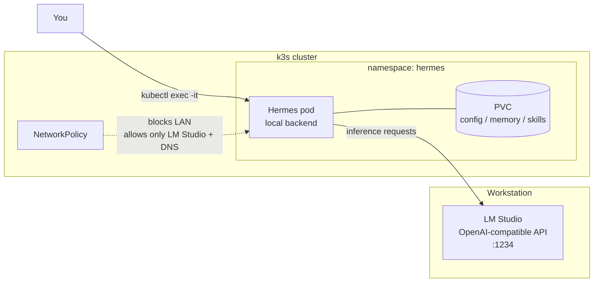

# Running Hermes Agent in k3s (sandboxed, with LM Studio)

This guide walks through deploying [Hermes Agent](https://github.com/nousresearch/hermes-agent)
— Nous Research's self-improving AI agent — inside the homelab k3s cluster, and wiring it to a
local model served by **LM Studio** running on a workstation.

The goal is **isolation**. Hermes autonomously executes shell commands and writes its own
"skills" to disk. Running it in a hardened pod keeps that activity inside a disposable container
instead of on a personal machine: if the agent misbehaves, you delete the pod and redeploy.

## Why run it in k3s?

Hermes has *seven* terminal backends that decide **where its shell commands actually run** —
`local`, `docker`, `ssh`, `singularity`, `modal`, `daytona`, and `vercel`. When you deploy
Hermes as a pod and leave the backend on `local`, every command the agent runs executes
**inside that pod** — its own filesystem and namespaces — not on your host.

That is the isolation we want. But a default pod is **not** a strong security boundary. This
guide applies four extra controls on top:

| Risk | Control in this guide |
|------|-----------------------|
| Agent reaches the Kubernetes API with the pod's service-account token | `automountServiceAccountToken: false` + an unbound ServiceAccount |
| Agent scans/attacks other homelab services | `NetworkPolicy` that blocks the LAN, allowing only LM Studio |
| Container escape to the node | Non-root, dropped capabilities, no privilege escalation, `seccomp` |
| Lost work / corrupted state | Dedicated `PersistentVolumeClaim`, nothing on a `hostPath` |

!!! warning "Keep the terminal backend on `local`"
    The isolation in this guide only holds while Hermes uses the in-pod `local` backend. If you
    later switch it to `ssh` (or a cloud sandbox), you hand the agent access to whatever is on
    the other end. Do not change the backend unless you understand that trade-off.

## Overview



Inference traffic — and only inference traffic — leaves the pod and reaches LM Studio. LM Studio
just serves the model; it gives Hermes **no shell access** to the workstation.

## Prerequisites

- A running k3s cluster with `kubectl` configured — see
  [K8s Cluster Setup](k8s-cluster-setup.md).
- k3s with its built-in NetworkPolicy controller enabled (the default — do **not** start k3s
  with `--disable-network-policy`).
- Docker on a build machine, with access to the Harbor registry at
  `192.168.1.206:30002` — see [Harbor & K8s Deployment](harbor-k8s-deployment.md).
- Cluster nodes already configured to pull from Harbor's HTTP registry — see
  [K8s Harbor HTTP Registry Setup](k8s-harbor-http-registry.md).
- A workstation on the LAN running **LM Studio**, with a known static IP. This guide uses
  `192.168.1.50` as the placeholder — **replace it with your workstation's IP throughout.**

## Step 1: Serve the Model from LM Studio

By default LM Studio's server only listens on `localhost`, which a pod cannot reach.

1. Open LM Studio → **Developer** tab (or **Local Server**).
2. Load a model. A capable agentic model that fits modest hardware is a good start — e.g. a
   ~5 GB Q4 model. Heavier models give better tool-use behaviour.
3. **Set the context length to at least 32K tokens.** Hermes's system prompt alone is ~17K
   tokens, and tool use needs headroom. Per-model: *My Models* → gear icon → context length.
4. Enable **"Serve on Local Network"** (binds to `0.0.0.0` instead of `127.0.0.1`).
5. Enable **CORS** if the toggle is present.
6. Start the server. Note the port — the default is **1234**.

Verify it from another machine on the LAN:

```bash
curl http://192.168.1.50:1234/v1/models
```

You should get a JSON list of loaded models. If the connection is refused, re-check the
"Serve on Local Network" toggle and the workstation's firewall.

!!! tip "Keep LM Studio reachable"
    The workstation must be powered on with LM Studio's server running whenever you use Hermes.
    For an always-available setup, run the model on an always-on host instead of a laptop.

## Step 2: Build the Hermes Image and Push to Harbor

Hermes ships a `Dockerfile`. Build it on your Docker machine and push the image to Harbor so
the cluster can pull it.

```bash
git clone https://github.com/nousresearch/hermes-agent.git
cd hermes-agent

# Build, tagging for the Harbor registry
docker build -t 192.168.1.206:30002/library/hermes-agent:latest .

# Log in and push
docker login 192.168.1.206:30002
docker push 192.168.1.206:30002/library/hermes-agent:latest
```

Confirm the `hermes-agent` repository appears in the Harbor web UI under the `library` project.

!!! info "Image internals may change between releases"
    Hermes is under active development. The container's data paths, default user, and entry
    command can shift between versions. The manifests below use the paths from the current
    container layout (`/opt/data` for config/memory/skills, `/app/data` for agent working
    files); if a Hermes release moves them, adjust the `volumeMounts` accordingly.

## Step 3: Namespace and Storage

Create a dedicated, locked-down namespace and a `PersistentVolumeClaim` for Hermes's state.
k3s provides the `local-path` StorageClass out of the box.

```yaml title="hermes-namespace-storage.yaml"
apiVersion: v1
kind: Namespace
metadata:
  name: hermes
  labels:
    # Enforce the strictest Pod Security Standard on this namespace
    pod-security.kubernetes.io/enforce: restricted
    pod-security.kubernetes.io/enforce-version: latest
---
# An unbound ServiceAccount: no RoleBindings, so it grants no cluster access
apiVersion: v1
kind: ServiceAccount
metadata:
  name: hermes
  namespace: hermes
automountServiceAccountToken: false
---
apiVersion: v1
kind: PersistentVolumeClaim
metadata:
  name: hermes-data
  namespace: hermes
spec:
  accessModes:
    - ReadWriteOnce
  storageClassName: local-path
  resources:
    requests:
      storage: 5Gi
```

```bash
kubectl apply -f hermes-namespace-storage.yaml
```

## Step 4: The Hardened Deployment

This runs the pod idle (`sleep infinity`) so you can attach an interactive Hermes session with
`kubectl exec`. The `securityContext` blocks satisfy the `restricted` Pod Security Standard.

```yaml title="hermes-deployment.yaml"
apiVersion: apps/v1
kind: Deployment
metadata:
  name: hermes
  namespace: hermes
  labels:
    app: hermes
spec:
  replicas: 1
  strategy:
    type: Recreate          # single PVC, ReadWriteOnce — no overlapping pods
  selector:
    matchLabels:
      app: hermes
  template:
    metadata:
      labels:
        app: hermes
    spec:
      serviceAccountName: hermes
      automountServiceAccountToken: false
      securityContext:
        runAsNonRoot: true
        runAsUser: 1000
        runAsGroup: 1000
        fsGroup: 1000          # makes the PVC writable by the non-root user
        seccompProfile:
          type: RuntimeDefault
      containers:
        - name: hermes
          image: 192.168.1.206:30002/library/hermes-agent:latest
          imagePullPolicy: IfNotPresent
          # Keep the pod alive; you attach interactively via kubectl exec
          command: ["sleep", "infinity"]
          securityContext:
            allowPrivilegeEscalation: false
            capabilities:
              drop: ["ALL"]
          resources:
            requests:
              memory: "256Mi"
              cpu: "100m"
            limits:
              memory: "1Gi"
              cpu: "1000m"
          volumeMounts:
            - name: data
              mountPath: /opt/data      # Hermes config, memories, skills
              subPath: hermes-data
            - name: data
              mountPath: /app/data      # agent working files
              subPath: working-dir
            - name: tmp
              mountPath: /tmp
      volumes:
        - name: data
          persistentVolumeClaim:
            claimName: hermes-data
        - name: tmp
          emptyDir: {}
      imagePullSecrets:
        - name: harbor-secret
```

The deployment references a `harbor-secret` for pulling the image. Create it in the `hermes`
namespace (same pattern as the [Harbor guide](harbor-k8s-deployment.md)):

```bash
kubectl create secret docker-registry harbor-secret \
  --docker-server=192.168.1.206:30002 \
  --docker-username=<harbor-username> \
  --docker-password=<harbor-password> \
  --namespace=hermes
```

Then apply the deployment:

```bash
kubectl apply -f hermes-deployment.yaml
```

!!! note "`readOnlyRootFilesystem` is intentionally omitted"
    A self-improving agent installs dependencies for the skills it writes (pip/npm packages),
    which a read-only root filesystem would break. The PVC and an `emptyDir` for `/tmp` cover
    the writable paths the agent needs; the rest of the container is still ephemeral and reset
    on every redeploy.

## Step 5: Lock Down the Network

This is the control that stops the agent from touching the rest of the homelab. The policy
denies **all inbound** traffic and allows outbound only to DNS, LM Studio, and the public
internet — explicitly **not** the LAN.

```yaml title="hermes-networkpolicy.yaml"
apiVersion: networking.k8s.io/v1
kind: NetworkPolicy
metadata:
  name: hermes-egress
  namespace: hermes
spec:
  podSelector:
    matchLabels:
      app: hermes
  policyTypes:
    - Ingress
    - Egress
  # No inbound connections at all — you only reach the agent via kubectl exec
  ingress: []
  egress:
    # DNS resolution
    - ports:
        - { protocol: UDP, port: 53 }
        - { protocol: TCP, port: 53 }
    # LM Studio on the workstation — the ONLY LAN address allowed
    - to:
        - ipBlock:
            cidr: 192.168.1.50/32
      ports:
        - { protocol: TCP, port: 1234 }
    # Public internet (for skill dependencies), but NOT private LAN ranges
    - to:
        - ipBlock:
            cidr: 0.0.0.0/0
            except:
              - 10.0.0.0/8
              - 172.16.0.0/12
              - 192.168.0.0/16
      ports:
        - { protocol: TCP, port: 443 }
        - { protocol: TCP, port: 80 }
```

```bash
kubectl apply -f hermes-networkpolicy.yaml
```

!!! tip "Want a fully offline agent?"
    For a strict local-only experiment, **delete the public-internet egress rule**. Hermes will
    then reach only LM Studio and DNS. The trade-off: skills that need to download packages will
    fail. Add the rule back when you need it.

## Step 6: Run Hermes Interactively

Attach an interactive shell to the pod and launch the agent:

```bash
# Wait for the pod to be Running
kubectl get pods -n hermes -w

# Attach an interactive session
kubectl exec -it deployment/hermes -n hermes -- hermes
```

On first launch, Hermes runs its **setup wizard**. When it asks for the model provider:

1. Choose **LM Studio** (or **Custom endpoint** if LM Studio is not offered).
2. For the base URL, enter your workstation's address — **not** `localhost`:

   ```
   http://192.168.1.50:1234/v1
   ```

3. Leave the API key blank (or any placeholder — LM Studio ignores it).
4. Enter the model name exactly as LM Studio reports it (from the `Step 1` `curl` output).

The wizard writes `config.yaml` into `/opt/data`, which lives on the PVC — so the configuration
**survives pod restarts**. You can also pre-set it without the wizard:

```yaml title="/opt/data/config.yaml (excerpt)"
model:
  default: your-model-name
  provider: lmstudio
  base_url: http://192.168.1.50:1234/v1
  context_length: 32768
```

Useful in-session commands: `/model` to switch provider or model, `/reset` to clear the chat.

## Step 7: Verify

Run these checks to confirm the deployment and its guardrails:

```bash
# Pod is running and healthy
kubectl get pods -n hermes

# The service-account token is NOT mounted (expect "No such file or directory")
kubectl exec deployment/hermes -n hermes -- \
  ls /var/run/secrets/kubernetes.io/serviceaccount/ 2>&1

# LM Studio IS reachable from the pod
kubectl exec deployment/hermes -n hermes -- \
  curl -s http://192.168.1.50:1234/v1/models

# Another homelab service is NOT reachable (expect a timeout / failure)
kubectl exec deployment/hermes -n hermes -- \
  curl -s --max-time 5 http://192.168.1.206:30002/ 2>&1
```

Inside a `hermes` session, ask the agent to run a harmless command (e.g. *"list the files in the
current directory"*) and confirm it operates inside the pod — paths like `/app/data`, not your
host's filesystem.

## Troubleshooting

**Pod stuck in `ImagePullBackOff`**

- Confirm `harbor-secret` exists in the `hermes` namespace.
- Confirm cluster nodes are configured for Harbor's HTTP registry — see
  [K8s Harbor HTTP Registry Setup](k8s-harbor-http-registry.md).

**Pod stuck in `CreateContainerConfigError` or fails Pod Security admission**

- The image may default to root. Check with `docker run --rm --entrypoint id <image>`. If it
  is not UID 1000, adjust `runAsUser`/`runAsGroup`/`fsGroup` to match a non-root user the image
  provides, or rebuild the image with a non-root user.

**Hermes cannot reach the model**

- From the pod: `kubectl exec deployment/hermes -n hermes -- curl http://192.168.1.50:1234/v1/models`.
- If it fails: check the `ipBlock` CIDR in the NetworkPolicy matches the workstation IP, that
  LM Studio's "Serve on Local Network" is on, and the workstation firewall allows port 1234.

**Agent reports it "has no file access"**

- This is a known Hermes quirk. Tell it once, in-session, that it has full read/write access to
  `/app/data`. To make that permanent, add the instruction to `/opt/data/SOUL.md`, which Hermes
  injects into every message.

**Context-length / truncation errors**

- The model's context window is too small. Raise it to 32K in LM Studio and set
  `context_length: 32768` in `config.yaml`.

## Security Checklist

Before considering the deployment "safe to experiment with", confirm:

- [ ] Terminal backend is `local` (commands run in-pod).
- [ ] `automountServiceAccountToken: false` and the ServiceAccount has **no** RoleBindings.
- [ ] NetworkPolicy is applied; the pod **cannot** reach other homelab services.
- [ ] Pod runs non-root, with `allowPrivilegeEscalation: false` and all capabilities dropped.
- [ ] No `hostPath` mounts, no `privileged`, no `hostNetwork`.
- [ ] State lives on a PVC — the pod itself is disposable.

## Tear-Down

Because everything is namespaced, removing Hermes is one command:

```bash
kubectl delete namespace hermes
```

This deletes the deployment, NetworkPolicy, ServiceAccount, and — note — the PVC and all of the
agent's memories and skills. Back up the PVC contents first if you want to keep them.

---

## Summary

This guide deployed Hermes Agent into k3s as a hardened, network-isolated pod and connected it
to a local LM Studio model. The agent runs its shell commands inside a disposable container,
cannot reach the Kubernetes API or the rest of the homelab, and keeps its state on a dedicated
volume — a far safer place to experiment with an autonomous agent than a personal workstation.
