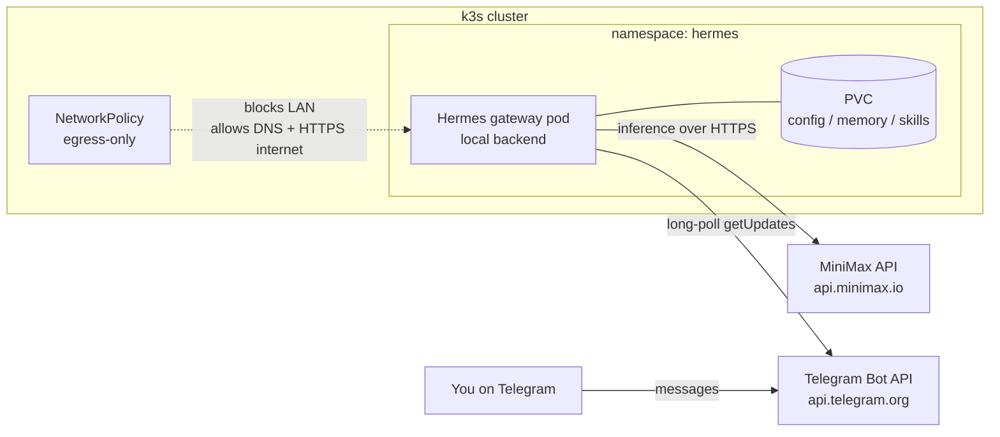

# Running Hermes Agent in k3s (sandboxed, Telegram + MiniMax)

This guide deploys [Hermes Agent](https://github.com/NousResearch/hermes-agent) — Nous Research's
self-improving AI agent — into the homelab k3s cluster as a **Telegram bot** backed by the
**MiniMax** cloud model. You chat with the agent from Telegram on any device; the agent itself
runs locked inside an isolated namespace.

The goal is **isolation**. Hermes autonomously executes shell commands and writes its own
"skills" to disk. Running it in a hardened, network-restricted pod keeps that activity inside a
disposable container instead of on a personal machine: if the agent misbehaves, you delete the
pod and redeploy.

## Why this shape works for isolation

Two design choices keep the blast radius small:

- **Telegram long-polling, not webhooks.** The gateway reaches *out* to `api.telegram.org` to
  fetch messages — it never accepts an inbound connection. So the pod needs **no Ingress, no
  exposed port, no LoadBalancer**. You talk to it through Telegram's cloud, not through the
  cluster network.
- **MiniMax is a cloud API.** Inference leaves the pod over plain HTTPS to `api.minimax.io`.
  There is no local model server to wire up and no extra LAN address to open.

Both of the agent's lifelines — Telegram and MiniMax — are **outbound HTTPS to the public
internet**. That lets the NetworkPolicy below take a hard line: allow DNS and outbound 443, and
block the entire LAN. The agent can think and chat, but it cannot reach Harbor, Pi-hole, or any
other homelab service.

Hermes also has *seven* terminal backends that decide **where its shell commands actually run** —
`local`, `docker`, `ssh`, `singularity`, `modal`, `daytona`, and `vercel`. We keep it on
`local`, so every command the agent runs executes **inside its own pod**, not on your host.

!!! warning "Keep the terminal backend on `local`"
    The isolation here only holds while Hermes uses the in-pod `local` backend. If you later
    switch it to `ssh` (or a cloud sandbox), you hand the agent access to whatever is on the
    other end. Do not change the backend unless you understand that trade-off.

## Overview



Your message goes to Telegram's cloud; the pod pulls it down on its next poll, runs the agent,
and pushes the reply back out — all over outbound HTTPS. No traffic ever enters the cluster.

## Prerequisites

- A running k3s cluster with `kubectl` configured — see
  [K8s Cluster Setup](k8s-cluster-setup.md).
- k3s with its built-in NetworkPolicy controller enabled (the default — do **not** start k3s
  with `--disable-network-policy`).
- **Cluster nodes can reach the public internet** to pull `nousresearch/hermes-agent` from
  Docker Hub and to let the agent reach Telegram and MiniMax.
- A **MiniMax API key** — from the [MiniMax platform](https://www.minimax.io/) console.
- A **Telegram account** to create the bot and find your user ID (Step 2).

## Step 1: Get a MiniMax API Key

1. Sign in to the MiniMax platform and open the API-keys / console section.
2. Create an API key and copy it. This is the value for `MINIMAX_API_KEY` below.
3. Hermes defaults to the global endpoint `https://api.minimax.io`. If your account is on the
   China platform instead, you'll use `MINIMAX_CN_API_KEY` and the `minimax-cn` provider — adjust
   the manifests accordingly.

The model this guide selects is **`MiniMax-M2.7`**, MiniMax's agentic model. You can switch
later from inside Telegram with `/model`.

## Step 2: Create the Telegram Bot

1. In Telegram, message [@BotFather](https://t.me/BotFather) and send `/newbot`.
2. Pick a display name and a unique username ending in `bot`.
3. BotFather replies with an **API token** like `123456789:AAEx...`. This is `TELEGRAM_BOT_TOKEN`.
4. Find **your own** numeric Telegram user ID: message [@userinfobot](https://t.me/userinfobot).
   It replies with your ID (a number like `987654321`). This is `TELEGRAM_ALLOWED_USERS`.

!!! danger "Always set an allowlist"
    `TELEGRAM_ALLOWED_USERS` restricts who the bot will respond to. **Never leave it empty** —
    a bot token is effectively public, and without an allowlist *anyone* who finds your bot can
    drive a shell-executing agent. Add only your own ID (comma-separate to add more people).

## Step 3: Namespace, ServiceAccount, and Storage

Create a dedicated namespace, an unbound ServiceAccount with **no** API access, and a
`PersistentVolumeClaim` for Hermes's config, memory, and skills. k3s provides the `local-path`
StorageClass out of the box.

```yaml title="hermes-namespace-storage.yaml"
apiVersion: v1
kind: Namespace
metadata:
  name: hermes
  labels:
    # The official image's s6 init starts as root to chown the data volume, then
    # drops to UID 10000 — so this namespace uses 'baseline', not 'restricted'.
    # 'restricted' is set to warn/audit so you can see what a rootless rebuild would unlock.
    pod-security.kubernetes.io/enforce: baseline
    pod-security.kubernetes.io/enforce-version: latest
    pod-security.kubernetes.io/warn: restricted
    pod-security.kubernetes.io/audit: restricted
---
# An unbound ServiceAccount: no RoleBindings, so it grants no cluster access
apiVersion: v1
kind: ServiceAccount
metadata:
  name: hermes
  namespace: hermes
automountServiceAccountToken: false
---
apiVersion: v1
kind: PersistentVolumeClaim
metadata:
  name: hermes-data
  namespace: hermes
spec:
  accessModes:
    - ReadWriteOnce
  storageClassName: local-path
  resources:
    requests:
      storage: 5Gi
```

```bash
kubectl apply -f hermes-namespace-storage.yaml
```

## Step 4: Store the Secrets

Put the MiniMax key, the Telegram token, and the user allowlist into a Kubernetes `Secret`.
The Deployment injects these as environment variables, so nothing sensitive is baked into the
image or the config file.

```bash
kubectl create secret generic hermes-secrets \
  --namespace=hermes \
  --from-literal=MINIMAX_API_KEY='<your-minimax-api-key>' \
  --from-literal=TELEGRAM_BOT_TOKEN='123456789:AAEx-your-bot-token' \
  --from-literal=TELEGRAM_ALLOWED_USERS='987654321'
```

!!! tip "Rotating a token"
    To change a value later, delete and recreate the secret, then
    `kubectl rollout restart deployment/hermes -n hermes` to pick it up.

## Step 5: Seed the Agent Config

Hermes reads `config.yaml` from `/opt/data` (its data volume). This `ConfigMap` holds a minimal
config that selects the MiniMax provider/model and pins the terminal backend to `local`. An
init container copies it onto the PVC **only if no config exists yet**, so any later changes you
make from inside Telegram (e.g. `/model`) survive restarts.

```yaml title="hermes-config.yaml"
apiVersion: v1
kind: ConfigMap
metadata:
  name: hermes-config
  namespace: hermes
data:
  config.yaml: |
    model:
      provider: minimax
      default: MiniMax-M2.7
    terminal:
      backend: local
```

```bash
kubectl apply -f hermes-config.yaml
```

## Step 6: The Deployment

This runs `gateway run` as the pod's main process — that's the Telegram-facing gateway. The
image's s6 init starts as root to fix volume ownership, then drops the gateway to UID 10000
(`hermes`). The init container seeds the config first.

```yaml title="hermes-deployment.yaml"
apiVersion: apps/v1
kind: Deployment
metadata:
  name: hermes
  namespace: hermes
  labels:
    app: hermes
spec:
  replicas: 1
  strategy:
    type: Recreate          # single ReadWriteOnce PVC — no overlapping pods
  selector:
    matchLabels:
      app: hermes
  template:
    metadata:
      labels:
        app: hermes
    spec:
      serviceAccountName: hermes
      automountServiceAccountToken: false
      securityContext:
        fsGroup: 10000              # PVC group-owned by the hermes user
        seccompProfile:
          type: RuntimeDefault
      initContainers:
        - name: seed-config
          image: busybox:1.36
          command:
            - sh
            - -c
            - |
              if [ ! -f /opt/data/config.yaml ]; then
                cp /seed/config.yaml /opt/data/config.yaml
                echo "seeded config.yaml"
              else
                echo "config.yaml already present — leaving as-is"
              fi
          volumeMounts:
            - { name: data, mountPath: /opt/data }
            - { name: seed, mountPath: /seed }
      containers:
        - name: hermes
          image: docker.io/nousresearch/hermes-agent:latest
          imagePullPolicy: Always
          args: ["gateway", "run"]   # Telegram gateway (long polling); no inbound port needed
          envFrom:
            - secretRef:
                name: hermes-secrets
          securityContext:
            # NOTE: we do NOT set runAsNonRoot or drop ALL caps — the s6 init needs root
            # + CHOWN/SETUID/SETGID to set up the volume and drop to UID 10000 itself.
            allowPrivilegeEscalation: false
            capabilities:
              drop: ["NET_RAW"]      # block raw sockets / ping-style scanning
          # Mark the pod Ready only once the gateway has actually connected to Telegram.
          # The container is "running" long before that (it pulls the image and syncs ~90
          # bundled skills first), and the ✓-connected line is written to a log FILE, not
          # stdout — so this exec probe greps that file. Until it passes, `kubectl get pods`
          # shows the pod as not-Ready and `kubectl rollout status` blocks.
          readinessProbe:
            exec:
              command:
                - sh
                - -c
                - grep -q "Gateway running with" /opt/data/logs/gateway.log
            initialDelaySeconds: 20
            periodSeconds: 10
            failureThreshold: 30      # allow up to ~5 min for first-boot image pull + skill sync
          resources:
            requests:
              memory: "512Mi"
              cpu: "250m"
            limits:
              memory: "2Gi"
              cpu: "2000m"
          volumeMounts:
            - { name: data, mountPath: /opt/data }   # config, memory, skills, .env
            - { name: tmp,  mountPath: /tmp }
      volumes:
        - name: data
          persistentVolumeClaim:
            claimName: hermes-data
        - name: seed
          configMap:
            name: hermes-config
        - name: tmp
          emptyDir: {}
```

```bash
kubectl apply -f hermes-deployment.yaml
```

!!! note "Why not `restricted` PSS + `runAsNonRoot`?"
    The official image's `/init` (s6-overlay) runs as root so it can `chown` the bind-mounted
    data volume on first boot, then drops every service — including the gateway — to UID 10000.
    Forcing `runAsNonRoot: true` or `capabilities.drop: ["ALL"]` breaks that startup. The agent
    process itself still ends up non-root; we accept a root *init* in exchange for the image
    working unmodified. The real containment here is the NetworkPolicy, the missing SA token,
    and the absence of any host mounts — not the in-pod UID. If you rebuild the image to init
    rootless, tighten this namespace to `restricted`.

!!! note "`readOnlyRootFilesystem` is intentionally omitted"
    A self-improving agent installs dependencies for the skills it writes (pip/npm packages),
    which a read-only root filesystem would break. The PVC and an `emptyDir` for `/tmp` cover
    the writable paths; the rest of the container is ephemeral and reset on every redeploy.

## Step 7: Lock Down the Network

This is the control that stops the agent from touching the rest of the homelab. It denies **all
inbound** traffic (the gateway never needs any) and allows outbound only to DNS and HTTPS on the
public internet — explicitly **not** the LAN. That HTTPS rule is what lets the agent reach both
Telegram and MiniMax.

```yaml title="hermes-networkpolicy.yaml"
apiVersion: networking.k8s.io/v1
kind: NetworkPolicy
metadata:
  name: hermes-egress
  namespace: hermes
spec:
  podSelector:
    matchLabels:
      app: hermes
  policyTypes:
    - Ingress
    - Egress
  # No inbound connections at all — long polling means the pod only reaches out.
  ingress: []
  egress:
    # DNS resolution
    - ports:
        - { protocol: UDP, port: 53 }
        - { protocol: TCP, port: 53 }
    # Public internet over HTTPS (Telegram + MiniMax), but NOT the private LAN
    - to:
        - ipBlock:
            cidr: 0.0.0.0/0
            except:
              - 10.0.0.0/8
              - 172.16.0.0/12
              - 192.168.0.0/16
      ports:
        - { protocol: TCP, port: 443 }
        - { protocol: TCP, port: 80 }
```

```bash
kubectl apply -f hermes-networkpolicy.yaml
```

!!! warning "DNS may live on your LAN"
    The egress rule above allows DNS to any destination. If your cluster's DNS (CoreDNS) or an
    upstream resolver like Pi-hole sits in a blocked RFC1918 range and the policy interferes,
    scope the DNS rule to the `kube-system` namespace instead. On stock k3s, CoreDNS resolution
    keeps working because cluster-internal traffic is matched by the port-53 rule. Verify with
    the DNS check in Step 9 and widen only if needed.

## Step 8: Wait Until the Gateway Is Ready

!!! danger "Don't message the bot until it's connected"
    On first boot the pod pulls a large image and syncs ~90 bundled skills — the gateway only
    starts polling Telegram **a minute or two after the container is `Running`**. Any message you
    send *before* it connects is **dropped, not queued**: the gateway discards the pre-startup
    backlog so it doesn't replay stale messages. This is the single most common reason a first
    message "gets no reply" — the bot simply wasn't listening yet.

Two signals are **not** reliable readiness indicators:

- `kubectl get pods` showing `1/1 Running` — that's just the container process, not the gateway.
- The `⚕ Hermes Gateway Starting…` banner in `kubectl logs` — it prints *before* it connects.

The trustworthy "connected and polling" line is `Gateway running with N platform(s)`, written to
a log **file** inside the pod (`/opt/data/logs/gateway.log`), not to stdout. The `readinessProbe`
in Step 6 watches exactly that, so the simplest check is the pod's Ready column:

```bash
# Once READY shows 1/1, the gateway is connected and safe to message.
kubectl get pods -n hermes -w
```

Or block until ready right after deploying (handy in scripts):

```bash
kubectl wait --for=condition=Ready pod -l app=hermes -n hermes --timeout=300s \
  && echo "✅ Gateway up — safe to message the bot"
```

To watch the connection happen directly, tail the gateway log file:

```bash
kubectl exec -n hermes deployment/hermes -- tail -f /opt/data/logs/gateway.log
# look for:  ✓ telegram connected   /   Gateway running with 1 platform(s)
```

## Step 9: Verify

```bash
# The service-account token is NOT mounted (expect "No such file or directory")
kubectl exec deployment/hermes -n hermes -- \
  ls /var/run/secrets/kubernetes.io/serviceaccount/ 2>&1

# Confirm which bot the token belongs to — message THIS exact @username, nothing else
kubectl exec -n hermes deployment/hermes -- sh -c \
  'python3 -c "import os,urllib.request as u,json; print(json.load(u.urlopen(\"https://api.telegram.org/bot\"+os.environ[\"TELEGRAM_BOT_TOKEN\"]+\"/getMe\"))[\"result\"][\"username\"])"'

# DNS + outbound HTTPS work (Telegram reachable). The image has no wget/curl — use python.
kubectl exec deployment/hermes -n hermes -- \
  python3 -c 'import urllib.request as u; u.urlopen("https://api.telegram.org",timeout=10); print("telegram reachable")'

# A homelab service is NOT reachable (expect a timeout / failure)
kubectl exec deployment/hermes -n hermes -- \
  python3 -c 'import urllib.request as u; u.urlopen("http://192.168.1.206:30002/",timeout=5)' 2>&1 \
  | grep -q . && echo "LAN blocked (good)"
```

Then the real test: open Telegram, find the bot **by the exact username from `getMe` above**, press
**Start**, and send a message like *"hello, what can you do?"*. It should reply. Confirm the model
leg in the logs — you want `provider=minimax`, not a fallback:

```bash
kubectl exec -n hermes deployment/hermes -- \
  grep -E "provider=minimax|API call" /opt/data/logs/agent.log | tail -3
```

Finally, ask it to *"list the files in your working directory"* and confirm the paths are in-pod
(under `/opt/data`), **not** your host's filesystem.

## Troubleshooting

**Pod stuck in `ImagePullBackOff`**

- Confirm the cluster nodes can reach Docker Hub: `docker pull nousresearch/hermes-agent` from a
  node. If you pull through a registry mirror, mirror this image too.

**Pod crash-loops on startup with a permissions or s6 error**

- The image needs its root `/init` to set up the volume. Make sure you did **not** add
  `runAsNonRoot: true` or `capabilities.drop: ["ALL"]` to the container — see the PSS note in
  Step 6. If a hardening tool injected them, remove them for this workload.

**First message got no reply (but later ones work)**

- Expected if you messaged the bot **before the gateway finished starting** — that message was
  dropped, not queued (see the Step 8 warning). Wait for the pod to report `Ready`, then send a
  fresh message. This is *not* a misconfiguration.

**Bot is silent / doesn't reply in Telegram**

- First, confirm the pod is `Ready` (Step 8) — the gateway may still be connecting.
- Confirm you're messaging the **right bot**. Run the `getMe` check in Step 9 to print the exact
  `@username` the token belongs to, and message that one. (A token can belong to a different bot
  than you think — e.g. an older one from a previous experiment.)
- Check the gateway received anything:
  `kubectl exec -n hermes deployment/hermes -- python3 -c 'import os,urllib.request as u,json; print(json.load(u.urlopen("https://api.telegram.org/bot"+os.environ["TELEGRAM_BOT_TOKEN"]+"/getWebhookInfo")))'`
  — a non-empty `url` means a leftover **webhook** is stealing updates from polling; clear it with
  the same API's `deleteWebhook`.
- If messages arrive but are ignored: **your user ID isn't in `TELEGRAM_ALLOWED_USERS`**. Re-check
  the ID from [@userinfobot](https://t.me/userinfobot), update the secret, and roll out a restart.
- Confirm the bot isn't already running elsewhere (Telegram allows only one long-poller per token —
  stop any local `hermes gateway` using the same bot).

**Agent replies but model calls fail / fall back**

- A wrong or missing `MINIMAX_API_KEY` makes MiniMax tasks fall back to a default provider and
  log a warning. Verify the key, and that the pod can reach `https://api.minimax.io` (the Step 9
  HTTPS check). For China-platform accounts, use `MINIMAX_CN_API_KEY` + the `minimax-cn` provider.

**`errors.log` shows `openrouter`/`nous` "payment / credit error" or "no Nous authentication"**

- Harmless. These come from Hermes's **auxiliary** model (used for side tasks like auto-titling a
  chat), which probes OpenRouter/Nous first. With no keys for those, it logs a warning and falls
  back to your main provider — you'll see `Auxiliary auto-detect: using main provider minimax`.
  To silence the noise, add an `OPENROUTER_API_KEY` to the secret or ignore it.

**Bot replies "No home channel is set… type `/sethome`"**

- Expected on first contact, not an error. A "home channel" is only where Hermes delivers
  *unsolicited* output (cron-job results, cross-platform messages). For normal chat you can ignore
  it; send `/sethome` in the chat if you want scheduled output delivered there.

**Want to reconfigure interactively**

- You can run the wizard inside the pod: `kubectl exec -it deployment/hermes -n hermes -- hermes
  gateway setup` (Telegram) or `hermes setup` (model/provider). Changes land in `/opt/data` on
  the PVC and survive restarts.

**Agent reports it "has no file access"**

- A known Hermes quirk. Tell it once, in-chat, that it has full read/write access to its working
  directory. To make it permanent, add the instruction to `/opt/data/SOUL.md`, which Hermes
  injects into every message.

## Managing Who Can Use the Bot

`TELEGRAM_ALLOWED_USERS` is the access list — the bot ignores anyone whose numeric Telegram ID
isn't in it. To hand the bot to a different person, or add more people, update that one key in the
`hermes-secrets` Secret and restart the pod.

1. **Get the user's Telegram ID** — have them message [@userinfobot](https://t.me/userinfobot),
   which replies with their numeric ID.

2. **Patch just the allowlist key** (replace `NEW_TELEGRAM_ID`):

   ```bash
   kubectl patch secret hermes-secrets -n hermes --type merge \
     -p "{\"data\":{\"TELEGRAM_ALLOWED_USERS\":\"$(printf 'NEW_TELEGRAM_ID' | base64)\"}}"
   ```

   For **multiple** users, comma-separate the IDs with no spaces, e.g.
   `printf '111111111,222222222'`.

3. **Restart so the gateway picks up the change.** Env vars from a Secret are injected at pod
   start, so a running pod keeps the old value until it restarts:

   ```bash
   kubectl rollout restart deployment/hermes -n hermes
   kubectl wait --for=condition=Ready pod -l app=hermes -n hermes --timeout=300s
   ```

4. **Verify** the value the pod now sees:

   ```bash
   kubectl exec -n hermes deployment/hermes -- sh -c 'echo "$TELEGRAM_ALLOWED_USERS"'
   ```

!!! warning "This replaces the list — don't lock yourself out"
    The patch **overwrites** `TELEGRAM_ALLOWED_USERS`. To keep your own access *and* add someone,
    include both IDs comma-separated. Listing only their ID removes yours. The same pattern works
    for rotating any value (`TELEGRAM_BOT_TOKEN`, `MINIMAX_API_KEY`) — patch the key, restart.

## Connecting MCP Servers (External Tools)

Hermes is an MCP **client**, so you can extend the agent with tools from MCP servers. With the
`claude` CLI you'd run `claude mcp add --transport http <name> <url> --header "Authorization:
Bearer …"`; Hermes has no equivalent one-liner — you declare servers in `config.yaml` under
`mcp_servers`. It resolves `${VAR}` placeholders in `url` and `headers` from the environment at
connect time (including everything injected from your Secret), so **tokens never sit in the config
file**. After changing MCP config, reload in-chat with `/reload-mcp` — no pod restart needed.

### Generic HTTP MCP server

1. Store the server's token in the Secret (it becomes an env var in the pod):

   ```bash
   kubectl patch secret hermes-secrets -n hermes --type merge \
     -p "{\"data\":{\"EXAMPLE_TOKEN\":\"$(printf 'your-token' | base64)\"}}"
   ```

2. Add an `mcp_servers` block to `config.yaml`, referencing the token with `${EXAMPLE_TOKEN}`:

   ```yaml
   mcp_servers:
     example:
       url: "https://mcp.example.com/mcp"
       headers:
         Authorization: "Bearer ${EXAMPLE_TOKEN}"
       tools:
         include: [list_things, get_thing]   # optional: limit which tools the agent may call
   ```

3. Apply it to the running pod and reload (see the colony example for the exact commands).

Tools are exposed to the agent as `mcp_<server>_<tool>`; use `tools.include` / `tools.exclude` to
restrict them.

### Example: the colony MCP server (in-cluster)

`colony` runs **in the same k3s cluster** — its ingress `http://mcp.colony-dev.dev.lan/mcp`
resolves to a node IP (`192.168.1.206`), but behind that it's a Kubernetes Service,
`colony-mcp` in namespace `colony-dev`, listening on port `8002`. Because of that, you reach it
from the pod by its **in-cluster Service DNS name**, and you open the firewall to it with a
**namespace + pod selector** — which is both correct and far tighter than any IP rule.

!!! danger "Why an `ipBlock` rule for the ingress IP does *not* work"
    It's tempting to allow `192.168.1.206:80` (the ingress). That fails: `192.168.1.206:80` is a
    NodePort/LoadBalancer that **DNATs** the connection to the Traefik pod on a *different* port
    before the NetworkPolicy is evaluated. The policy sees the post-DNAT destination (a `10.42.x`
    pod IP on Traefik's container port), so an `ipBlock: 192.168.1.206/32` allow never matches and
    the connection is refused. Target the backing Service's pods instead, as below.

**1. Put the colony token in the Secret**

```bash
kubectl patch secret hermes-secrets -n hermes --type merge \
  -p "{\"data\":{\"COLONY_PAT\":\"$(printf 'colony_pat_your_new_token_here' | base64)\"}}"
```

**2. Register the server in `config.yaml`**

Use the in-cluster Service URL (`colony-mcp.colony-dev.svc.cluster.local:8002`) — the app-level
Bearer token still authenticates you when hitting the Service directly. Append the block to the
live config on the PVC (no in-pod editor required), then reload:

```bash
kubectl exec -n hermes deployment/hermes -i -- sh -c 'cat >> /opt/data/config.yaml' <<'YAML'
mcp_servers:
  colony:
    url: "http://colony-mcp.colony-dev.svc.cluster.local:8002/mcp"
    headers:
      Authorization: "Bearer ${COLONY_PAT}"
YAML
```

Also mirror the same block into the `hermes-config` ConfigMap (Step 5) so a fresh redeploy keeps it.
Remember the init container only seeds `config.yaml` when the PVC is empty, so the ConfigMap covers
*new* deployments while the `cat >>` above updates the *current* one. (If `config.yaml` already has
an `mcp_servers:` key, merge into it rather than appending a second one.)

**3. Open the network to colony-mcp only**

Add **one** egress rule to the policy from Step 7 — alongside the existing DNS and internet rules,
*not* replacing them. It matches only the `colony-mcp` pods in `colony-dev`, on port `8002`:

```yaml
  egress:
    # ... keep the existing DNS + internet rules ...

    # Colony MCP server — ONLY the colony-mcp pods in namespace colony-dev
    - to:
        - namespaceSelector:
            matchLabels:
              kubernetes.io/metadata.name: colony-dev
          podSelector:
            matchLabels:
              app.kubernetes.io/instance: colony
              app.kubernetes.io/component: mcp
      ports:
        - { protocol: TCP, port: 8002 }
```

```bash
kubectl apply -f hermes-networkpolicy.yaml
```

!!! tip "Selector targeting beats an IP allow"
    Because `namespaceSelector` + `podSelector` (combined in one `to:` element) pin the rule to the
    exact MCP pods, the agent can reach **only** `colony-mcp:8002` — not colony's frontend, backend,
    or Postgres, and nothing else behind the shared ingress. Find the right labels with
    `kubectl get pod -n colony-dev --show-labels` (here: `app.kubernetes.io/instance=colony`,
    `app.kubernetes.io/component=mcp`). For a colony deployment in a different namespace, adjust both
    selectors.

**4. Reload and verify**

```bash
# In Telegram, send this to the bot to reload MCP without restarting:
/reload-mcp

# Confirm the pod can reach colony-mcp (HTTP 406/401 = reachable; the app answered)…
kubectl exec -n hermes deployment/hermes -- python3 -c \
  "import urllib.request as u, urllib.error
try:
    print('HTTP', u.urlopen('http://colony-mcp.colony-dev.svc.cluster.local:8002/mcp', timeout=8).status)
except urllib.error.HTTPError as e: print('HTTP', e.code, '(reachable)')"

# …while colony's OTHER services and the cluster stay blocked:
kubectl exec -n hermes deployment/hermes -- python3 -c \
  "import socket; s=socket.socket(); s.settimeout(5)
try: s.connect(('10.43.130.136',5432)); print('postgres REACHABLE (leak)')
except Exception as e: print('colony postgres blocked:', type(e).__name__)"
./scripts/verify-hermes-isolation.sh hermes
```

Then ask the bot in Telegram what tools it has — colony's appear as `mcp_colony_*`.

!!! note "The isolation script stays green"
    `verify-hermes-isolation.sh` still passes — its decisive probe is the Kubernetes API ClusterIP,
    which remains blocked. The selector rule only reaches `colony-mcp:8002`, so it doesn't widen the
    LAN the way an `ipBlock` would.

### Confirm the MCP connection

Rather than reading logs by hand, run the repo's MCP checker against the namespace. For every
server in `config.yaml`'s `mcp_servers`, it verifies — from the live pod — that the `${VAR}`
placeholders resolve, the server's `host:port` is reachable through the NetworkPolicy, the gateway
actually registered its tools, and that no auth/credential errors occurred when the agent called
them:

```bash
./scripts/verify-hermes-mcp.sh hermes        # pass your namespace
```

```text
● colony  http://colony-mcp.colony-dev.svc.cluster.local:8002/mcp
    ✔ PASS  all ${VAR} placeholders resolve: COLONY_PAT
    ✔ PASS  TCP reachable at colony-mcp.colony-dev.svc.cluster.local:8002
    ✔ PASS  connected — 35 tool(s) registered (per agent.log)
    ✔ PASS  no auth/tool-call errors in logs
```

It prints `PASS`/`WARN`/`FAIL` per check and exits non-zero if any server isn't fully working, so it
doubles as a post-deploy gate. The checks map cleanly to where things break:

| FAIL line | Fix |
|-----------|-----|
| env var(s) not set in pod | Add the token to the Secret and restart (`${VAR}` is read from the env). |
| cannot reach `host:port` | The NetworkPolicy has no egress rule to that server — add one (see Step "Open the network"). |
| no `registered N tool(s)` line | The gateway hasn't connected; check `config.yaml` and restart. |
| token rejected (HTTP 401) | The plumbing is fine but the server refused the credential — wrong/expired token, or it belongs to a different instance. |

## Security Checklist

Before considering the deployment "safe to experiment with", confirm:

- [ ] Terminal backend is `local` (commands run in-pod).
- [ ] `TELEGRAM_ALLOWED_USERS` is set to your ID(s) — the bot ignores everyone else.
- [ ] `automountServiceAccountToken: false` and the ServiceAccount has **no** RoleBindings.
- [ ] NetworkPolicy is applied; the pod **cannot** reach other homelab services.
- [ ] No `hostPath` mounts, no `privileged`, no `hostNetwork`, no exposed Ingress/port.
- [ ] Secrets live in a `Secret`, not in the image or `config.yaml`.
- [ ] State lives on a PVC — the pod itself is disposable.
- [ ] Any MCP egress hole is as narrow as possible, and MCP tokens are `${VAR}` references to the
      Secret — not pasted into `config.yaml`.

### Automated isolation check

Rather than walking the list by hand, run the repo's checker against the namespace. It verifies
every item above from the live cluster — no SA token or RoleBindings, no host access, the
NetworkPolicy is present, the agent backend is `local`, and (from inside the pod) that DNS and
outbound HTTPS work while the Kubernetes API and the LAN are **blocked**:

```bash
./scripts/verify-hermes-isolation.sh hermes        # pass your namespace
```

It prints `PASS`/`WARN`/`FAIL` per check and exits non-zero if any critical control is missing,
so it also works in CI or a pre-flight gate. To additionally prove a *specific* homelab service is
unreachable, point it at one (host:port that you know has a listener):

```bash
TEST_LAN_TARGET=192.168.1.206:30002 ./scripts/verify-hermes-isolation.sh hermes
```

!!! note "Blocked may show as 'rejected', not 'timeout'"
    A correctly blocked connection can appear as either a **timeout** (drop-mode policy engines)
    or a **connection refused / RST** (reject-mode engines like k3s/kube-router). The script
    treats both as blocked — only an actual `CONNECTED` to a private target is a leak. The
    decisive probe targets the Kubernetes API ClusterIP, which always has a listener, so a
    successful connect there unambiguously means egress is leaking.

## Tear-Down

Because everything is namespaced, removing Hermes is one command:

```bash
kubectl delete namespace hermes
```

This deletes the Deployment, NetworkPolicy, ServiceAccount, ConfigMap, Secret, and — note — the
PVC and all of the agent's memories and skills. Back up the PVC contents first if you want to
keep them. You may also want to delete or revoke the bot via [@BotFather](https://t.me/BotFather)
(`/deletebot`) and rotate the MiniMax key.

---

## Summary

This guide deployed Hermes Agent into k3s as a hardened, egress-only Telegram bot backed by the
MiniMax cloud model. You drive it from Telegram — restricted to an allowlist of user IDs — while
the agent runs its shell commands inside a disposable container that cannot reach the Kubernetes
API or the rest of the homelab, and keeps its state on a dedicated volume. A far safer place to
experiment with an autonomous agent than a personal workstation.

## References

- [Hermes Agent docs](https://hermes-agent.nousresearch.com/docs/) — gateway, providers, secrets
- [Hermes Agent repo](https://github.com/NousResearch/hermes-agent)
- [Harbor & K8s Deployment](harbor-k8s-deployment.md) — registry / pull-secret pattern (if you
  later mirror the image into Harbor)
- [Borra Bot Journal on k3s](borra-bot-journal-deployment.md) — sibling bot deployment
