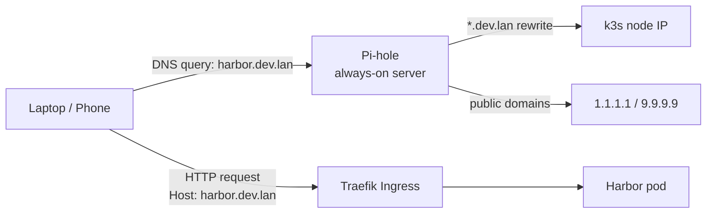

# Pi-hole as Local DNS for the Homelab

This guide walks through running Pi-hole in Docker on an always-on server so the homelab can reach
services by hostname (e.g. `harbor.dev.lan`, `colony.dev.lan`) instead of by IP and port.

Pi-hole acts as the LAN's DNS server: every device on the network asks it to resolve names, and we
configure it with a wildcard record that points `*.dev.lan` at the k3s ingress IP. Traefik (built
into k3s) then routes requests by hostname.

As a bonus, Pi-hole filters ads and trackers at the DNS level for every device on the network.

## Overview



## Prerequisites

- An always-on server on the LAN (separate from the k3s nodes recommended) with a static IP.
- Docker and Docker Compose installed on that server.
- Admin access to the home router (to change the DHCP DNS server setting).
- A planned hostname suffix for internal services. This guide uses `dev.lan`. **Do not use
  `.local`** — it conflicts with mDNS/Bonjour and causes intermittent resolution failures.

## Step 1: Free Port 53 on the Host

On Ubuntu/Debian hosts, `systemd-resolved` listens on `127.0.0.53:53` and will conflict with
Pi-hole. Disable its stub listener:

```bash
sudo mkdir -p /etc/systemd/resolved.conf.d
sudo tee /etc/systemd/resolved.conf.d/disable-stub-listener.conf > /dev/null <<'EOF'
[Resolve]
DNSStubListener=no
EOF

# Replace the symlinked resolv.conf so the host can still resolve names while Pi-hole boots
sudo rm /etc/resolv.conf
echo "nameserver 1.1.1.1" | sudo tee /etc/resolv.conf

sudo systemctl restart systemd-resolved
```

Verify nothing is listening on port 53:

```bash
sudo ss -tulpn | grep :53
# Expect no output
```

## Step 2: Create the Pi-hole Compose File

Pick a directory for persistent data, e.g. `/opt/pihole`:

```bash
sudo mkdir -p /opt/pihole/{etc-pihole,etc-dnsmasq.d}
cd /opt/pihole
```

Create `docker-compose.yml`:

```yaml
services:
  pihole:
    container_name: pihole
    image: pihole/pihole:latest
    # Host networking is the simplest path — Pi-hole binds directly to the LAN interface,
    # no port mapping gymnastics, and clients see the real source IP in query logs.
    network_mode: host
    environment:
      TZ: 'America/Mexico_City'           # set to your timezone
      WEBPASSWORD: 'CHANGE-ME-STRONG-PW'  # admin UI password
      PIHOLE_DNS_: '1.1.1.1;9.9.9.9'      # upstream resolvers
      DNSMASQ_LISTENING: 'local'          # only answer queries from the LAN
      VIRTUAL_HOST: 'pihole.dev.lan'      # admin UI hostname
    volumes:
      - ./etc-pihole:/etc/pihole
      - ./etc-dnsmasq.d:/etc/dnsmasq.d
    cap_add:
      - NET_ADMIN
    restart: unless-stopped
```

!!! warning "Bind to the LAN interface only"
    `DNSMASQ_LISTENING: local` tells Pi-hole to refuse queries that arrive from outside its
    subnet. Combined with **never port-forwarding port 53 on the router**, this prevents the
    server from being abused as an open resolver in DNS amplification attacks.

Bring it up:

```bash
sudo docker compose up -d
sudo docker compose logs -f pihole   # watch the first boot
```

## Step 3: Add the Wildcard DNS Record

This is the rule that makes `harbor.dev.lan`, `colony.dev.lan`, and any other `*.dev.lan` host
resolve to the k3s ingress IP.

First, find the IP that Traefik is listening on:

```bash
kubectl get svc -n kube-system traefik
```

Look at the `EXTERNAL-IP` column. In this homelab the Traefik service is exposed at
`192.168.1.206` and `192.168.1.208` (k3s's built-in service load balancer publishes one IP per
node). Either IP works — pick one and use it consistently.

Create `/opt/pihole/etc-dnsmasq.d/02-homelab.conf`:

```conf
# Wildcard: every *.dev.lan name (and any sub-subdomain like api.colony.dev.lan)
# resolves to the Traefik ingress IP.
address=/dev.lan/192.168.1.206
```

!!! tip "dnsmasq wildcards match all sub-levels"
    `address=/dev.lan/...` matches `harbor.dev.lan`, `colony.dev.lan`, AND
    `api.colony.dev.lan`, `foo.bar.dev.lan`, etc. One line covers every internal hostname.

Reload Pi-hole's DNS:

```bash
sudo docker exec pihole pihole restartdns
```

Test from another machine on the LAN:

```bash
dig @<pihole-ip> harbor.dev.lan +short
# Expect: 192.168.1.206
```

## Step 4: Point the LAN at Pi-hole

Tell every device on the network to use Pi-hole for DNS. The cleanest way is at the router:

1. Log in to the home router admin UI.
2. Find **DHCP settings** (often under LAN or Network).
3. Set **Primary DNS** to the Pi-hole server's static IP.
4. Set **Secondary DNS** to a public resolver (`1.1.1.1` or `9.9.9.9`) — see the trade-off note
   below.
5. Save and either restart the router or wait for DHCP leases to renew (usually under an hour).

!!! note "Secondary DNS trade-off"
    A public secondary keeps the internet working when Pi-hole is down, but clients will
    silently fall back and `*.dev.lan` won't resolve. Two options:

    - **Pragmatic:** keep the public secondary. Accept that Pi-hole going down breaks the
      internal hostnames temporarily.
    - **Strict:** leave the secondary blank. Internal names always work, but a Pi-hole outage
      breaks DNS for the whole household until it's restored.

Force a renewal on the device you're testing from, then check:

```bash
# macOS
scutil --dns | grep nameserver

# Linux
resolvectl status

nslookup harbor.dev.lan
```

## Step 5: Expose a k8s Application via Ingress

With DNS in place, the last piece is an `Ingress` resource per application that maps a hostname
to a Service inside the cluster. Traefik (built into k3s) reads these and starts routing.

The general pattern:

1. Identify the Service name, namespace, and port you want to expose.
2. Choose a hostname under your wildcard suffix (e.g. `<app>.dev.lan`).
3. Apply an Ingress that routes that hostname to the Service.
4. Browse to `http://<app>.dev.lan`.

The two examples below show this pattern at two levels of complexity: a single-service API, then
a frontend + backend application.

### Simple Example: `fast-api-docker` in `test-namespace`

This is the smallest possible case — one Deployment, one Service, one hostname. Inspect what's
running:

```bash
kubectl get svc -n test-namespace
```

```text
NAME                      TYPE       CLUSTER-IP    PORT(S)
fast-api-docker-service   NodePort   10.43.56.94   80:30470/TCP
```

The Service listens on port **80** internally (the `80:30470` means "container port 80, exposed
as NodePort 30470"). The Ingress will target port 80, the NodePort becomes irrelevant once the
hostname is in place.

**Pick a hostname** — `fast-api.dev.lan` is descriptive and already covered by the `*.dev.lan`
wildcard, so no Pi-hole changes are needed.

**Create the Ingress** as `fast-api-ingress.yaml`:

```yaml
apiVersion: networking.k8s.io/v1
kind: Ingress
metadata:
  name: fast-api
  namespace: test-namespace
spec:
  ingressClassName: traefik
  rules:
    - host: fast-api.dev.lan
      http:
        paths:
          - path: /
            pathType: Prefix
            backend:
              service:
                name: fast-api-docker-service
                port:
                  number: 80
```

**Apply and verify:**

```bash
kubectl apply -f fast-api-ingress.yaml

kubectl get ingress -n test-namespace
# NAME       CLASS     HOSTS              ADDRESS                       PORTS
# fast-api   traefik   fast-api.dev.lan   192.168.1.206,192.168.1.208   80

curl -I http://fast-api.dev.lan
# HTTP/1.1 200 OK   (or 404 / docs response, depending on the API's root route)

# FastAPI auto-generated docs:
open http://fast-api.dev.lan/docs
```

That's the entire flow for a single-service app. Once this works, multi-service apps are just
the same thing repeated.

### Advanced Example: `colony-dev` (Frontend + Backend)

The `colony-dev` namespace runs three services:

```bash
kubectl get svc -n colony-dev
```

```text
NAME                    TYPE        CLUSTER-IP      PORT(S)
colony-dev-frontend     NodePort    10.43.129.82    3000:30081/TCP
colony-dev-backend      NodePort    10.43.88.200    8000:30801/TCP
colony-dev-postgresql   ClusterIP   10.43.139.235   5432/TCP
```

Today these are reached via NodePort (`http://<node-ip>:30081`, `http://<node-ip>:30801`). After
this step you'll reach them by name instead.

!!! warning "Do not expose internal services"
    Only expose what end users need: **frontend** and **backend**. The PostgreSQL service is
    `ClusterIP`-only by design — it must stay reachable only from inside the cluster. Never
    create an Ingress for a database.

**Choose hostnames.** Two clean options:

| Pattern | Frontend | Backend | Notes |
|---|---|---|---|
| Subdomain (recommended) | `colony.dev.lan` | `api.colony.dev.lan` | Cleanest. Frontend and backend are independently routed; no path-rewrite headaches; CORS stays simple. |
| Path-based | `colony.dev.lan/` | `colony.dev.lan/api` | Single hostname, but you'll likely need path stripping middleware so the backend doesn't see `/api` in its routes. |

This guide uses the subdomain pattern. Both hostnames are covered by the existing `*.dev.lan`
wildcard, so **no Pi-hole changes are needed when adding new apps** — you only edit Pi-hole when
you add a brand-new TLD or want a record outside the wildcard.

**Create the Ingress manifest.** Save as `colony-dev-ingress.yaml`:

```yaml
apiVersion: networking.k8s.io/v1
kind: Ingress
metadata:
  name: colony-dev-frontend
  namespace: colony-dev
spec:
  ingressClassName: traefik
  rules:
    - host: colony.dev.lan
      http:
        paths:
          - path: /
            pathType: Prefix
            backend:
              service:
                name: colony-dev-frontend
                port:
                  number: 3000
---
apiVersion: networking.k8s.io/v1
kind: Ingress
metadata:
  name: colony-dev-backend
  namespace: colony-dev
spec:
  ingressClassName: traefik
  rules:
    - host: api.colony.dev.lan
      http:
        paths:
          - path: /
            pathType: Prefix
            backend:
              service:
                name: colony-dev-backend
                port:
                  number: 8000
```

A few notes on the manifest:

- `namespace: colony-dev` — Ingresses must live in the same namespace as the Service they target.
- `port.number: 3000` / `8000` — these are the **Service ports**, not the NodePort ports. Look at
  the first number in the `PORT(S)` column of `kubectl get svc`.
- `ingressClassName: traefik` — matches the IngressClass already installed in your cluster
  (verify with `kubectl get ingressclass`).
- The Services can stay `NodePort` or be changed to `ClusterIP`. Either works for ingress
  routing. `ClusterIP` is slightly tidier since the NodePort fallback is no longer needed.

**Apply and verify:**

```bash
kubectl apply -f colony-dev-ingress.yaml

kubectl get ingress -n colony-dev
# NAME                  CLASS     HOSTS                   ADDRESS                           PORTS
# colony-dev-frontend   traefik   colony.dev.lan          192.168.1.206,192.168.1.208       80
# colony-dev-backend    traefik   api.colony.dev.lan      192.168.1.206,192.168.1.208       80
```

From a LAN client (the Pi-hole change must already be live):

```bash
dig colony.dev.lan +short          # → 192.168.1.206
dig api.colony.dev.lan +short      # → 192.168.1.206
curl -I http://colony.dev.lan      # → HTTP 200 from the frontend
curl -I http://api.colony.dev.lan  # → HTTP 200/404 from the backend (depends on root route)
```

Open `http://colony.dev.lan` in a browser. If the frontend talks to the backend, point its API
base URL to `http://api.colony.dev.lan` (whatever env var or config drives that — typically a
`VITE_API_URL`, `NEXT_PUBLIC_API_URL`, or similar in the frontend Deployment).

### Adding More Apps

Repeat the pattern. To expose Harbor, for example:

```yaml
apiVersion: networking.k8s.io/v1
kind: Ingress
metadata:
  name: harbor
  namespace: harbor
spec:
  ingressClassName: traefik
  rules:
    - host: harbor.dev.lan
      http:
        paths:
          - path: /
            pathType: Prefix
            backend:
              service:
                name: harbor          # check the actual Service name with `kubectl get svc -n harbor`
                port:
                  number: 80
```

No Pi-hole changes needed — the wildcard already covers `harbor.dev.lan`.

## Security Hardening

| Risk | Mitigation |
|------|------------|
| Open resolver abuse (DNS amplification) | `DNSMASQ_LISTENING: local` set above. **Never** port-forward `53/tcp` or `53/udp` on the router. |
| Admin UI compromise | Strong `WEBPASSWORD`; access only over LAN. Do not expose `/admin` externally. |
| Query log privacy | Pi-hole logs every DNS query by default. Reduce retention in **Settings → Privacy**, or set the privacy level to "Anonymous logging" if other people share the network. |
| Single point of failure | Public secondary DNS at the router (covered above), or run a second Pi-hole and sync with [gravity-sync](https://github.com/vmstan/gravity-sync). |
| Stale upstream / poisoning | Use trustworthy upstreams (Cloudflare `1.1.1.1`, Quad9 `9.9.9.9`); enable DNSSEC under **Settings → DNS** if upstreams support it. |

## Maintenance

**Update Pi-hole:**

```bash
cd /opt/pihole
sudo docker compose pull
sudo docker compose up -d
```

**Back up settings.**

The `etc-pihole/` and `etc-dnsmasq.d/` directories contain everything. A periodic copy to a
different host (or to a backup folder on the k3s cluster) is enough to restore the full
configuration.

**Add another internal hostname.**

Either rely on the wildcard (just create the Ingress — no DNS change needed), or add a specific
record in `etc-dnsmasq.d/02-homelab.conf` and `pihole restartdns`.

## Troubleshooting

**`docker compose up` fails with "address already in use" on port 53.**
`systemd-resolved` is still bound. Re-run Step 1 and verify with `sudo ss -tulpn | grep :53`.

**Clients still resolve `harbor.dev.lan` to NXDOMAIN.**
The device is using cached DNS or a different resolver. Renew the DHCP lease, then check
`resolvectl status` (Linux) or `scutil --dns` (macOS) to confirm the device is actually using
Pi-hole.

**Pi-hole resolves the name but the browser shows a Traefik 404.**
DNS is working; the Ingress is wrong. Check `kubectl get ingress -A` and confirm the `host:`
field matches exactly, and that the backing Service exists in the same namespace.

**Pi-hole admin UI is unreachable.**
With host networking the UI is on `http://<pihole-ip>/admin`, port 80. Confirm nothing else on
the host is using port 80, and check `docker logs pihole`.

## Next Steps

- **HTTPS for internal services.** Either install [mkcert](https://github.com/FiloSottile/mkcert)
  on every client device for self-signed certs on `*.dev.lan`, or buy a real domain (~$10/yr) and
  use cert-manager with Let's Encrypt's DNS-01 challenge. The Ingress YAML stays the same — you
  just add a `tls:` block referencing a Secret that cert-manager populates.
- **Single ingress IP.** k3s's built-in service load balancer publishes Traefik on every node IP
  (here `192.168.1.206` and `192.168.1.208`). If you want a single floating IP that survives a
  node going offline, swap servicelb for [MetalLB](https://metallb.universe.tf/) in
  `L2` mode and update the Pi-hole wildcard to point at that IP.
