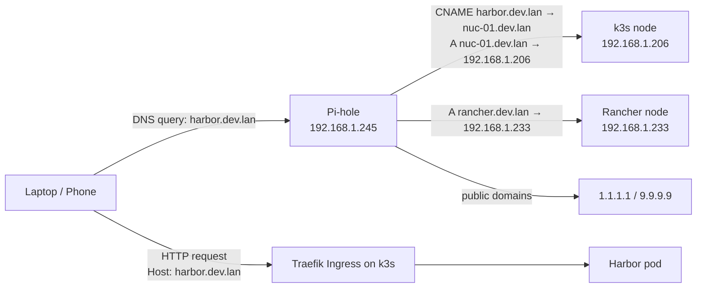

# Pi-hole as Local DNS for the Homelab

This guide walks through running Pi-hole on a bare-metal always-on server so the homelab can reach
services by hostname (e.g. `harbor.dev.lan`, `rancher.dev.lan`) instead of by IP and port.

Pi-hole acts as the LAN's DNS server: every device on the network asks it to resolve names. Pi-hole
does **not** use a wildcard here. Instead it holds a small set of explicit records:

- One **A record** per *endpoint* — the k3s ingress node (`nuc-01.dev.lan`), and any service that
  runs on its own host (Rancher).
- One **CNAME record** per *app* that lives behind the k3s ingress, pointing at
  `nuc-01.dev.lan`. Traefik (built into k3s) then routes the request by hostname.

As a bonus, Pi-hole filters ads and trackers at the DNS level for every device on the network.

## Overview



## Prerequisites

- An always-on server on the LAN (separate from the k3s nodes recommended) with a **static IP**.
  In this homelab Pi-hole runs bare-metal at `192.168.1.245`.
- Admin access to the home router (to change the DHCP DNS server setting).
- A hostname suffix for internal services. This homelab uses `dev.lan`. **Do not use `.local`**
  — it conflicts with mDNS/Bonjour and causes intermittent resolution failures.

## Step 1: Install Pi-hole (Bare-Metal)

On a dedicated box (Raspberry Pi OS, or any Debian/Ubuntu host), run the official installer:

```bash
curl -sSL https://install.pi-hole.net | bash
```

The installer frees port 53, installs Pi-hole as a system service, and prompts for the upstream
resolvers (use Cloudflare `1.1.1.1` and/or Quad9 `9.9.9.9`) and a static IP. Set the admin
password afterwards with `pihole setpassword`.

!!! info "systemd-resolved conflict"
    On Debian/Ubuntu, `systemd-resolved` listens on `127.0.0.53:53`. The Pi-hole installer
    detects this and offers to free the port. If it doesn't, disable the stub listener
    manually, then re-run the installer:

    ```bash
    sudo mkdir -p /etc/systemd/resolved.conf.d
    sudo tee /etc/systemd/resolved.conf.d/disable-stub-listener.conf > /dev/null <<'EOF'
    [Resolve]
    DNSStubListener=no
    EOF
    sudo systemctl restart systemd-resolved
    sudo ss -tulpn | grep :53   # expect no output before re-running the installer
    ```

!!! warning "Never expose Pi-hole as an open resolver"
    Under **Settings → DNS → Interface settings**, choose *Allow only local requests* (or bind
    to the LAN interface). Combined with **never port-forwarding port 53 on the router**, this
    prevents the server from being abused in DNS amplification attacks.

## Step 2: Add the Local DNS Records (A + CNAME)

This is the core of the setup. There is **no wildcard** — every hostname is an explicit record.
The model is:

| Type  | Domain               | Target            | Why |
|-------|----------------------|-------------------|-----|
| A     | `nuc-01.dev.lan`     | `192.168.1.206`   | The k3s node where the Traefik ingress listens. |
| CNAME | `harbor.dev.lan`     | `nuc-01.dev.lan`  | Harbor — lives behind the k3s ingress. |
| CNAME | `fast-api.dev.lan`   | `nuc-01.dev.lan`  | fast-api example app — behind the k3s ingress. |
| CNAME | `colony.dev.lan`     | `nuc-01.dev.lan`  | colony frontend — behind the k3s ingress. |
| CNAME | `api.colony.dev.lan` | `nuc-01.dev.lan`  | colony backend — behind the k3s ingress. |
| A     | `rancher.dev.lan`    | `192.168.1.233`   | Rancher management UI — its **own node**, *not* behind the k3s ingress. |

!!! tip "Why CNAMEs instead of one A record per app"
    Every app behind the k3s ingress shares the same IP. Pointing each one at
    `nuc-01.dev.lan` via a CNAME means the ingress IP is written down **once**. If the ingress
    moves (e.g. you switch to a MetalLB floating IP), you change the single `nuc-01.dev.lan` A
    record and every app follows automatically.

    Rancher is the exception: it is a separate Rancher install on its own node, so it gets a
    **direct A record** to `192.168.1.233`. A CNAME to `nuc-01.dev.lan` would point it at the
    wrong cluster entirely.

First, confirm the k3s ingress IP:

```bash
kubectl get svc -n kube-system traefik
```

The `EXTERNAL-IP` column shows the Traefik service IP — `192.168.1.206` in this homelab (k3s's
built-in service load balancer publishes one IP per node; pick one and use it consistently).

### Add the records in the Pi-hole web UI (recommended)

The web UI works the same on Pi-hole v5 and v6 and is the canonical way to manage these records.

1. **Local DNS → DNS Records** — add the **A records**:
    - Domain `nuc-01.dev.lan`, IP `192.168.1.206`
    - Domain `rancher.dev.lan`, IP `192.168.1.233`
2. **Local DNS → CNAME Records** — add one **CNAME** per app, all targeting `nuc-01.dev.lan`:
    - `harbor.dev.lan` → `nuc-01.dev.lan`
    - `fast-api.dev.lan` → `nuc-01.dev.lan`
    - `colony.dev.lan` → `nuc-01.dev.lan`
    - `api.colony.dev.lan` → `nuc-01.dev.lan`

!!! warning "Add the A record before the CNAME"
    Pi-hole only resolves a CNAME if its target is itself resolvable **by Pi-hole**. Create the
    `nuc-01.dev.lan` A record first, otherwise the app CNAMEs return nothing.

### CLI reference (optional)

Where these live on a bare-metal install depends on the Pi-hole version:

- **Pi-hole v5** — A records in `/etc/pihole/custom.list`
  (`192.168.1.206 nuc-01.dev.lan`), CNAMEs in
  `/etc/dnsmasq.d/05-pihole-custom-cname.conf` (`cname=harbor.dev.lan,nuc-01.dev.lan`).
  Reload with `sudo pihole restartdns`.
- **Pi-hole v6** — both live in `/etc/pihole/pihole.toml` under `dns.hosts` and
  `dns.cnameRecords`. The CLI (`pihole-FTL --config …`) **replaces the entire array**, so use
  the web UI to avoid clobbering existing records.

### Verify

Query Pi-hole directly so you're testing Pi-hole and not a client's cache:

```bash
dig @192.168.1.245 nuc-01.dev.lan   +short   # → 192.168.1.206
dig @192.168.1.245 harbor.dev.lan   +short   # → 192.168.1.206  (resolved via the CNAME)
dig @192.168.1.245 rancher.dev.lan  +short   # → 192.168.1.233
```

## Step 3: Point the LAN at Pi-hole

Tell devices on the network to use Pi-hole (`192.168.1.245`) for DNS. Two ways: network-wide at
the router (best — every device, zero per-machine config), or per-machine when the router won't
let you change DNS.

### Network-wide: router DHCP (recommended)

1. Log in to the home router admin UI.
2. Find **DHCP settings** (often under LAN or Network).
3. Set **Primary DNS** to `192.168.1.245` (the Pi-hole).
4. Set **Secondary DNS** to a public resolver (`1.1.1.1` or `9.9.9.9`) — see the trade-off note.
5. Save and either restart the router or wait for DHCP leases to renew (usually under an hour).

!!! note "Secondary DNS trade-off"
    A public secondary keeps the internet working when Pi-hole is down, but clients will
    silently fall back and `*.dev.lan` names won't resolve. Two options:

    - **Pragmatic:** keep the public secondary. Accept that a Pi-hole outage temporarily breaks
      internal hostnames.
    - **Strict:** leave the secondary blank. Internal names always work, but a Pi-hole outage
      breaks DNS for the whole household until it's restored.

### Per-machine: one Linux client

When the router's DNS field is locked (common on ISP gateways) or only one machine should use
Pi-hole, point that machine at `192.168.1.245` directly. See the dedicated
[Point a Linux Client at Pi-hole](point-linux-client-at-pihole.md) guide for the full
NetworkManager/systemd-resolved walkthrough.

## Step 4: Expose a k8s Application via Ingress

For an app running in the k3s cluster, two things are needed: a Kubernetes `Ingress` mapping the
hostname to a Service, and a Pi-hole **CNAME** so the hostname resolves.

The general pattern:

1. Identify the Service name, namespace, and port to expose.
2. Choose a hostname under `dev.lan` (e.g. `<app>.dev.lan`).
3. Add a Pi-hole CNAME `<app>.dev.lan → nuc-01.dev.lan` (Local DNS → CNAME Records).
4. Apply an Ingress routing that hostname to the Service.
5. Browse to `http://<app>.dev.lan`.

The two examples below show this pattern at two levels of complexity: a single-service API, then
a frontend + backend application.

### Simple Example: `fast-api-docker` in `test-namespace`

The smallest possible case — one Deployment, one Service, one hostname. Inspect what's running:

```bash
kubectl get svc -n test-namespace
```

```text
NAME                      TYPE       CLUSTER-IP    PORT(S)
fast-api-docker-service   NodePort   10.43.56.94   80:30470/TCP
```

The Service listens on port **80** internally (the `80:30470` means "container port 80, exposed
as NodePort 30470"). The Ingress targets port 80; the NodePort becomes irrelevant once the
hostname is in place.

**DNS:** add a CNAME `fast-api.dev.lan → nuc-01.dev.lan` in **Local DNS → CNAME Records**.

**Create the Ingress** as `fast-api-ingress.yaml`:

```yaml
apiVersion: networking.k8s.io/v1
kind: Ingress
metadata:
  name: fast-api
  namespace: test-namespace
spec:
  ingressClassName: traefik
  rules:
    - host: fast-api.dev.lan
      http:
        paths:
          - path: /
            pathType: Prefix
            backend:
              service:
                name: fast-api-docker-service
                port:
                  number: 80
```

**Apply and verify:**

```bash
kubectl apply -f fast-api-ingress.yaml

kubectl get ingress -n test-namespace
# NAME       CLASS     HOSTS              ADDRESS                       PORTS
# fast-api   traefik   fast-api.dev.lan   192.168.1.206,192.168.1.208   80

curl -I http://fast-api.dev.lan
# HTTP/1.1 200 OK   (or 404 / docs response, depending on the API's root route)

# FastAPI auto-generated docs:
open http://fast-api.dev.lan/docs
```

That's the entire flow for a single-service app. Once this works, multi-service apps are just
the same thing repeated.

### Advanced Example: `colony-dev` (Frontend + Backend)

The `colony-dev` namespace runs three services:

```bash
kubectl get svc -n colony-dev
```

```text
NAME                    TYPE        CLUSTER-IP      PORT(S)
colony-dev-frontend     NodePort    10.43.129.82    3000:30081/TCP
colony-dev-backend      NodePort    10.43.88.200    8000:30801/TCP
colony-dev-postgresql   ClusterIP   10.43.139.235   5432/TCP
```

Today these are reached via NodePort (`http://<node-ip>:30081`, `http://<node-ip>:30801`). After
this step you'll reach them by name instead.

!!! warning "Do not expose internal services"
    Only expose what end users need: **frontend** and **backend**. The PostgreSQL service is
    `ClusterIP`-only by design — it must stay reachable only from inside the cluster. Never
    create an Ingress for a database.

**Choose hostnames.** Two clean options:

| Pattern | Frontend | Backend | Notes |
|---|---|---|---|
| Subdomain (recommended) | `colony.dev.lan` | `api.colony.dev.lan` | Cleanest. Frontend and backend are independently routed; no path-rewrite headaches; CORS stays simple. |
| Path-based | `colony.dev.lan/` | `colony.dev.lan/api` | Single hostname, but you'll likely need path stripping middleware so the backend doesn't see `/api` in its routes. |

This guide uses the subdomain pattern, so add **two** CNAMEs in Pi-hole, both
→ `nuc-01.dev.lan`: `colony.dev.lan` and `api.colony.dev.lan`.

**Create the Ingress manifest.** Save as `colony-dev-ingress.yaml`:

```yaml
apiVersion: networking.k8s.io/v1
kind: Ingress
metadata:
  name: colony-dev-frontend
  namespace: colony-dev
spec:
  ingressClassName: traefik
  rules:
    - host: colony.dev.lan
      http:
        paths:
          - path: /
            pathType: Prefix
            backend:
              service:
                name: colony-dev-frontend
                port:
                  number: 3000
---
apiVersion: networking.k8s.io/v1
kind: Ingress
metadata:
  name: colony-dev-backend
  namespace: colony-dev
spec:
  ingressClassName: traefik
  rules:
    - host: api.colony.dev.lan
      http:
        paths:
          - path: /
            pathType: Prefix
            backend:
              service:
                name: colony-dev-backend
                port:
                  number: 8000
```

A few notes on the manifest:

- `namespace: colony-dev` — Ingresses must live in the same namespace as the Service they target.
- `port.number: 3000` / `8000` — these are the **Service ports**, not the NodePort ports. Look at
  the first number in the `PORT(S)` column of `kubectl get svc`.
- `ingressClassName: traefik` — matches the IngressClass already installed in your cluster
  (verify with `kubectl get ingressclass`).
- The Services can stay `NodePort` or be changed to `ClusterIP`. Either works for ingress
  routing. `ClusterIP` is slightly tidier since the NodePort fallback is no longer needed.

**Apply and verify:**

```bash
kubectl apply -f colony-dev-ingress.yaml

kubectl get ingress -n colony-dev
# NAME                  CLASS     HOSTS                   ADDRESS                           PORTS
# colony-dev-frontend   traefik   colony.dev.lan          192.168.1.206,192.168.1.208       80
# colony-dev-backend    traefik   api.colony.dev.lan      192.168.1.206,192.168.1.208       80
```

From a LAN client (the Pi-hole CNAMEs must already be live):

```bash
dig colony.dev.lan +short          # → 192.168.1.206  (via CNAME → nuc-01.dev.lan)
dig api.colony.dev.lan +short      # → 192.168.1.206  (via CNAME → nuc-01.dev.lan)
curl -I http://colony.dev.lan      # → HTTP 200 from the frontend
curl -I http://api.colony.dev.lan  # → HTTP 200/404 from the backend (depends on root route)
```

Open `http://colony.dev.lan` in a browser. If the frontend talks to the backend, point its API
base URL to `http://api.colony.dev.lan` (whatever env var or config drives that — typically a
`VITE_API_URL`, `NEXT_PUBLIC_API_URL`, or similar in the frontend Deployment).

### Adding More Apps

Repeat the pattern. To expose Harbor, for example:

1. Add a Pi-hole CNAME `harbor.dev.lan → nuc-01.dev.lan` (Local DNS → CNAME Records).
2. Apply the Ingress:

```yaml
apiVersion: networking.k8s.io/v1
kind: Ingress
metadata:
  name: harbor
  namespace: harbor
spec:
  ingressClassName: traefik
  rules:
    - host: harbor.dev.lan
      http:
        paths:
          - path: /
            pathType: Prefix
            backend:
              service:
                name: harbor          # check the actual Service name with `kubectl get svc -n harbor`
                port:
                  number: 80
```

Every new k3s app is exactly this: **one CNAME → `nuc-01.dev.lan`** plus its Ingress. You never
touch the A record.

## Step 5: Services on Their Own Node (Rancher)

Not everything sits behind the k3s ingress. The Rancher management UI is a separate Rancher
install on its own node at `192.168.1.233`. It must **not** be a CNAME to `nuc-01.dev.lan` —
that would route it into the wrong cluster.

Instead it is a **direct A record**:

- **Local DNS → DNS Records:** `rancher.dev.lan` → `192.168.1.233`

```bash
dig @192.168.1.245 rancher.dev.lan +short   # → 192.168.1.233
```

The full Rancher install and the "change the Rancher hostname" procedure (Helm upgrade,
regenerating the self-signed TLS cert, updating `server-url`) live in the
[Rancher Setup guide](rancher-setup.md). Any future service that runs on its own host follows
this same pattern: a direct A record to that host's IP, not a CNAME.

## Security Hardening

| Risk | Mitigation |
|------|------------|
| Open resolver abuse (DNS amplification) | **Settings → DNS → Interface settings** set to *Allow only local requests* (or bind to the LAN interface). **Never** port-forward `53/tcp` or `53/udp` on the router. |
| Admin UI compromise | Strong admin password (`pihole setpassword`); access only over LAN. Do not expose `/admin` externally. |
| Query log privacy | Pi-hole logs every DNS query by default. Reduce retention in **Settings → Privacy**, or set the privacy level to "Anonymous logging" if other people share the network. |
| Single point of failure | Public secondary DNS at the router (covered above), or run a second Pi-hole and sync with [gravity-sync](https://github.com/vmstan/gravity-sync). |
| Stale upstream / poisoning | Use trustworthy upstreams (Cloudflare `1.1.1.1`, Quad9 `9.9.9.9`); enable DNSSEC under **Settings → DNS** if upstreams support it. |

## Maintenance

**Update Pi-hole:**

```bash
sudo pihole -up
```

**Back up settings.** Everything is on the Pi-hole host:

- **v5:** `/etc/pihole/` (including `custom.list`) and `/etc/dnsmasq.d/`.
- **v6:** `/etc/pihole/` (including `pihole.toml`).

A periodic copy to a different host (or a backup folder on the k3s cluster) is enough to restore
the full configuration. The web UI also has **Settings → Teleporter** for a one-click export.

**Add another internal hostname.** Decide where the service actually lives:

- **Behind the k3s ingress** → add a **CNAME** `<app>.dev.lan → nuc-01.dev.lan`
  (Local DNS → CNAME Records). This is the common case.
- **On its own host** (like Rancher) → add an **A record** `<name>.dev.lan → <that host's IP>`
  (Local DNS → DNS Records).

!!! warning "Avoid the `.local` TLD"
    Use `rancher.dev.lan`, not `rancher.local`. `.local` is reserved for mDNS/Bonjour and
    causes intermittent resolution failures on machines running Avahi (most Linux desktops,
    all macOS). Keep every internal name under the single `dev.lan` suffix.

## Troubleshooting

**A `*.dev.lan` name returns NXDOMAIN / nothing.**
First isolate where it breaks:

```bash
dig @192.168.1.245 <name>.dev.lan +short   # ask Pi-hole directly
dig <name>.dev.lan +short                  # ask via the client's normal resolver
```

- Both fail → the record is missing or wrong in Pi-hole. For an app CNAME, also confirm the
  `nuc-01.dev.lan` A record exists (a CNAME whose target Pi-hole can't resolve returns nothing).
- Direct query works but the normal one doesn't → the client isn't using Pi-hole. Check
  `resolvectl status` (Linux) / `scutil --dns` (macOS) and renew the DHCP lease.

**Pi-hole resolves the name but the browser shows a Traefik 404.**
DNS is working; the Ingress is wrong. Check `kubectl get ingress -A` and confirm the `host:`
field matches exactly, and that the backing Service exists in the same namespace.

**`rancher.dev.lan` resolves to `192.168.1.206` instead of `192.168.1.233`.**
It was added as a CNAME to `nuc-01.dev.lan` by mistake. Delete the CNAME and add it as a direct
**A record** to `192.168.1.233` (Local DNS → DNS Records).

**Pi-hole admin UI is unreachable.**
The UI is at `http://192.168.1.245/admin`. Confirm the Pi-hole service is up
(`systemctl status pihole-FTL`) and that nothing else on the host is using port 80.

## Next Steps

- **HTTPS for internal services.** Either install [mkcert](https://github.com/FiloSottile/mkcert)
  on every client device for self-signed certs on `*.dev.lan`, or buy a real domain (~$10/yr) and
  use cert-manager with Let's Encrypt's DNS-01 challenge. The Ingress YAML stays the same — you
  just add a `tls:` block referencing a Secret that cert-manager populates.
- **Single ingress IP.** k3s's built-in service load balancer publishes Traefik on every node IP
  (here `192.168.1.206` and `192.168.1.208`). If you want a single floating IP that survives a
  node going offline, swap servicelb for [MetalLB](https://metallb.universe.tf/) in `L2` mode.
  With the CNAME model you only update the **one** `nuc-01.dev.lan` A record — every app CNAME
  follows automatically, no per-app changes.
