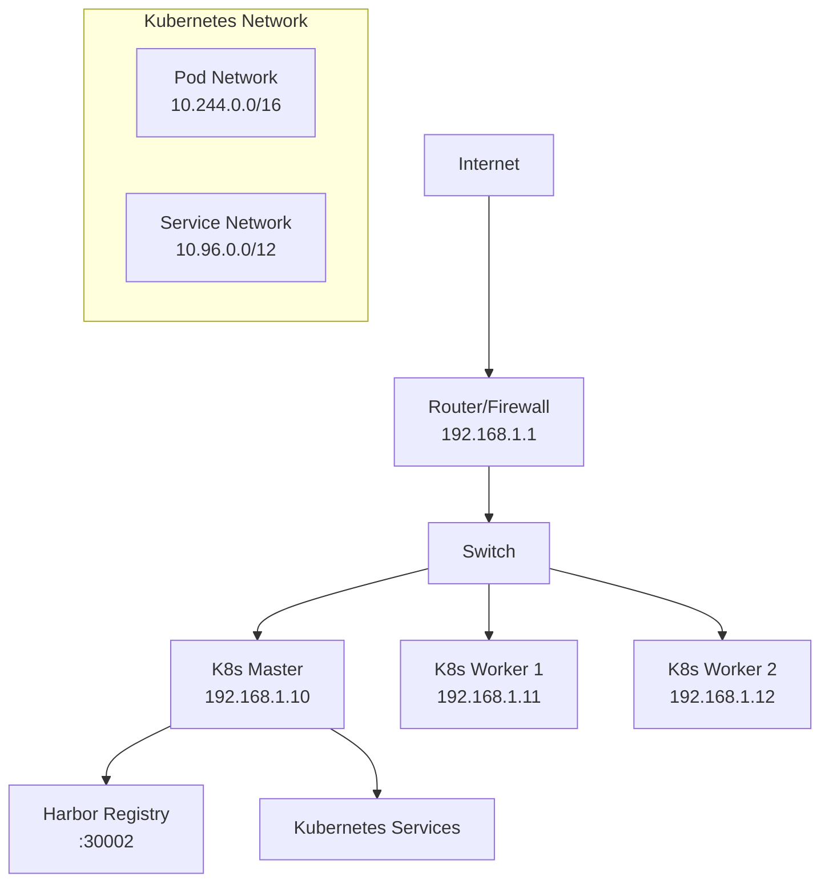

# Network Configuration

This page documents the network setup and configuration for my homelab.

## Network Overview

### IP Address Scheme

- **Network Range**: [e.g., 192.168.1.0/24]
- **Gateway**: [e.g., 192.168.1.1]
- **DNS Servers**: [e.g., 192.168.1.1, 8.8.8.8]

### Subnets

- **Management**: [e.g., 192.168.1.0/24] - General devices
- **Kubernetes**: [Pod and Service CIDRs]
- **Storage**: [If separate storage network]

## Device IP Assignments

### Infrastructure

| Device | IP Address | Purpose | Notes |
|--------|------------|---------|-------|
| Router | 192.168.1.1 | Gateway | |
| Switch | 192.168.1.2 | Network switching | |
| Harbor Registry | 192.168.1.206:30002 | Container registry | NodePort service |

### Kubernetes Nodes

| Node | IP Address | Role | Hostname |
|------|------------|------|----------|
| Master | [e.g., 192.168.1.10] | Control Plane | [hostname] |
| Worker 1 | [e.g., 192.168.1.11] | Worker | [hostname] |
| Worker 2 | [e.g., 192.168.1.12] | Worker | [hostname] |

## Kubernetes Network Configuration

### Cluster Networking

- **Pod CIDR**: [e.g., 10.244.0.0/16]
- **Service CIDR**: [e.g., 10.96.0.0/12]
- **CNI Plugin**: [e.g., Flannel, Calico, Cilium]

### Service Exposure

- **NodePort Range**: [e.g., 30000-32767]
- **LoadBalancer**: [If using MetalLB or similar]
- **Ingress Controller**: [If configured]

### Example Network Policy

```yaml
apiVersion: networking.k8s.io/v1
kind: NetworkPolicy
metadata:
  name: homelab-default-policy
spec:
  podSelector: {}
  policyTypes:
  - Ingress
  - Egress
  ingress:
  - from:
    - namespaceSelector: {}
  egress:
  - {}
```

## DNS Configuration

### Local DNS

- **Domain**: [e.g., homelab.local]
- **DNS Server**: [Local DNS server if any]

### Service Discovery

Kubernetes services are accessible via:

- **ClusterIP**: `service-name.namespace.svc.cluster.local`
- **NodePort**: `http://node-ip:nodeport`
- **External DNS**: [If configured]

## Firewall Rules

### Router/Firewall

- **SSH Access**: Port 22 to Kubernetes nodes
- **Kubernetes API**: Port 6443 to master node
- **NodePort Range**: 30000-32767 for services
- **Harbor Registry**: Port 30002 for Harbor access

### iptables (if applicable)

```bash
# Example firewall rules for Kubernetes nodes
# Allow kubelet API
iptables -A INPUT -p tcp --dport 10250 -j ACCEPT

# Allow NodePort services
iptables -A INPUT -p tcp --dport 30000:32767 -j ACCEPT

# Allow pod-to-pod communication
iptables -A INPUT -s 10.244.0.0/16 -j ACCEPT
```

## Network Monitoring

### Tools Used

- **ping**: Basic connectivity testing
- **nmap**: Port scanning and discovery
- **tcpdump**: Packet capture
- **iperf3**: Bandwidth testing

### Monitoring Commands

```bash
# Check node connectivity
ping -c 3 192.168.1.10

# Port scan cluster nodes
nmap -p 22,6443,10250 192.168.1.10-12

# Test Kubernetes service connectivity
kubectl run test-pod --image=busybox --rm -it -- wget -qO- http://service-name:port

# Check cluster network health
kubectl get nodes -o wide
kubectl get pods --all-namespaces -o wide
```

## Troubleshooting

### Common Network Issues

#### Node Connectivity

```bash
# Test basic connectivity
ping <node-ip>

# Check SSH access
ssh user@<node-ip>

# Verify ports are open
telnet <node-ip> <port>
```

#### Service Accessibility

```bash
# Check service endpoints
kubectl get endpoints

# Test service from within cluster
kubectl run debug --image=busybox --rm -it -- wget -qO- http://service-name

# Check NodePort services
curl http://<node-ip>:<nodeport>
```

#### DNS Resolution

```bash
# Test cluster DNS
kubectl run debug --image=busybox --rm -it -- nslookup kubernetes.default

# Check external DNS
kubectl run debug --image=busybox --rm -it -- nslookup google.com
```

### Network Debug Pod

```yaml
apiVersion: v1
kind: Pod
metadata:
  name: network-debug
spec:
  containers:
  - name: debug
    image: nicolaka/netshoot
    command: ["/bin/bash"]
    args: ["-c", "sleep 3600"]
```

## Security Considerations

### Network Segmentation

- **Cluster Isolation**: Kubernetes cluster on dedicated VLAN
- **Service Access**: Limited external access to services
- **Admin Access**: Secure SSH key-based authentication

### Security Policies

- **NetworkPolicies**: Restrict pod-to-pod communication
- **Ingress Filtering**: Control inbound traffic
- **Egress Filtering**: Control outbound traffic

## Performance Optimization

### Bandwidth Considerations

- **Internal Traffic**: Gigabit Ethernet between nodes
- **External Access**: [Internet connection speed]
- **Storage Traffic**: [Network storage bandwidth]

### Latency Optimization

- **Node Placement**: Nodes on same switch/VLAN
- **Service Location**: Critical services on dedicated nodes
- **Cache Strategy**: Local image caching with Harbor

## Network Diagram



## Future Network Plans

### Short Term

- [ ] [Network improvements planned]
- [ ] [Security enhancements]

### Long Term

- [ ] [Network architecture changes]
- [ ] [Performance upgrades]

---

*Keep this document updated when making network configuration changes.*
