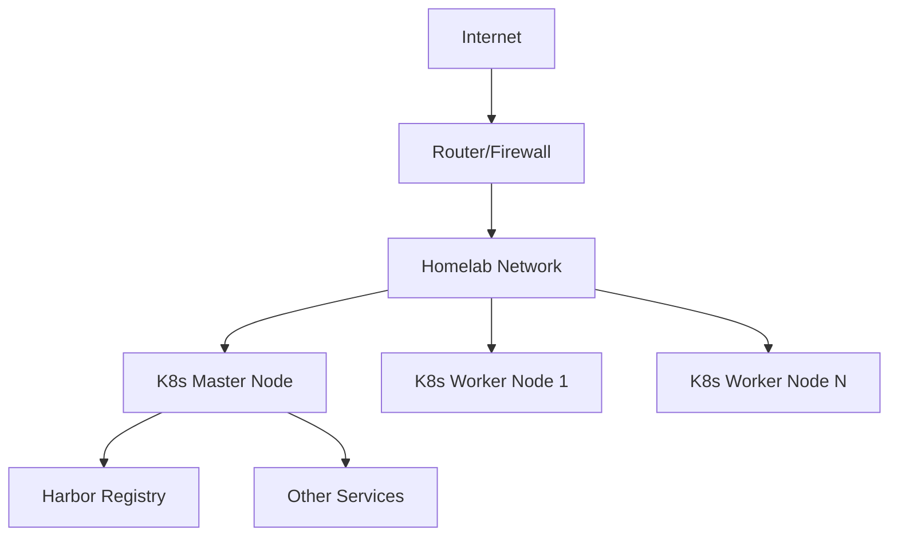

# Infrastructure Overview

This section describes the overall infrastructure setup of my homelab.

## Architecture

My homelab is built around a Kubernetes cluster that provides:

- Container orchestration
- Service discovery and load balancing
- Persistent storage management
- Network policies and security

## Key Components

### Kubernetes Cluster

- **Type**: k3s (Lightweight Kubernetes distribution)
- **Nodes**: 2 total - 1 control plane, 1 worker node ([Hardware details](hardware.md))
- **Version**: v1.33.4+k3s1

### Container Registry

- **Harbor Registry**: Running at `192.168.1.206:30002`
- **Purpose**: Private container image storage and vulnerability scanning

### Storage

- **Type**: [Add your storage solution]
- **Capacity**: [Add capacity info]

### Networking

- **CIDR**: [Add your cluster CIDR]
- **Service CIDR**: [Add service CIDR]
- **Ingress**: [Add ingress solution if any]

## Network Architecture

## Next Steps

- [Hardware Details](hardware.md)
- [Network Configuration](network.md)
- [Kubernetes Setup](kubernetes.md)
