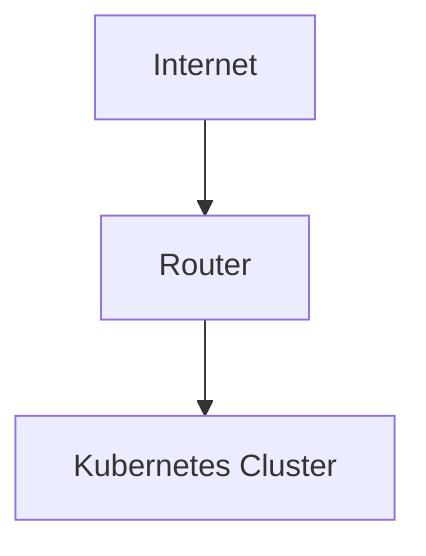

# Technologies Used

This page provides an overview of all the technologies, tools, and frameworks used in this homelab
documentation repository.

## Documentation Platform

### MkDocs

- **Purpose**: Static site generator for documentation
- **Version**: Latest
- **Why chosen**: Simple, fast, and markdown-focused
- **Configuration**: `mkdocs.yml`

**Key features used**:

- Automatic navigation generation
- Live reload during development
- Plugin system for extensibility
- Theme customization

**Commands**:

```bash
mkdocs serve    # Development server
mkdocs build    # Build static site
mkdocs deploy   # Deploy to GitHub Pages
```

### Material for MkDocs Theme

- **Purpose**: Modern, responsive theme for MkDocs
- **Why chosen**: Professional appearance, excellent mobile support, rich features
- **Features**: Dark/light mode, search, navigation tabs, syntax highlighting

**Key features enabled**:

- Navigation tabs and sections
- Code copy buttons
- Search highlighting
- Responsive design
- Social cards (if configured)

## Markup and Content

### Markdown

- **Purpose**: Primary content format
- **Flavor**: CommonMark with extensions
- **Extensions used**:
  - `admonition`: Call-out boxes for notes and warnings
  - `pymdownx.details`: Collapsible sections
  - `pymdownx.superfences`: Enhanced code blocks with Mermaid support
  - `pymdownx.highlight`: Syntax highlighting
  - `tables`: Table support
  - `footnotes`: Footnote references

### Mermaid

- **Purpose**: Diagram generation from text
- **Version**: 10.6.1
- **Use cases**: Network diagrams, flowcharts, architecture diagrams
- **Integration**: Via MkDocs superfences extension

**Example usage**:

```markdown


### YAML

- **Purpose**: Configuration files
- **Files**: `mkdocs.yml`, `.pre-commit-config.yaml`
- **Validation**: Automated via pre-commit hooks

## Development and Quality Tools

### Python Ecosystem

- **Python**: 3.8+ (for MkDocs and tools)
- **pip**: Package management
- **Virtual environments**: Dependency isolation

### Pre-commit Framework

- **Purpose**: Git hook management and automation
- **Language**: Python
- **Configuration**: `.pre-commit-config.yaml`

**Hooks used**:

- File quality checks (whitespace, line endings, file size)
- YAML validation
- Markdown linting
- Spell checking
- Code formatting

### Markdownlint

- **Purpose**: Markdown linting and style checking
- **Language**: Node.js
- **Configuration**: `.markdownlint.json`
- **Integration**: Pre-commit hook

**Key rules enforced**:

- Consistent heading styles
- Line length limits (120 chars)
- Proper list formatting
- Consistent emphasis usage

### typos

- **Purpose**: Spell checking for technical documentation
- **Language**: Rust
- **Benefits**: Fast, low false positives, developer-friendly

### Prettier

- **Purpose**: Code formatting for YAML and JSON
- **Language**: Node.js
- **Scope**: Configuration files only
- **Integration**: Pre-commit hook for consistency

## Version Control

### Git

- **Purpose**: Source control and collaboration
- **Hosting**: GitHub
- **Workflow**: Feature branches with pull requests

**Key files**:

- `.gitignore`: Excludes build artifacts, virtual environments, IDE files
- `.pre-commit-config.yaml`: Automated quality checks

### GitHub Features Used

- **Issues**: Bug tracking and feature requests
- **Pull Requests**: Code review and collaboration
- **GitHub Pages**: Documentation hosting (if configured)
- **Actions**: CI/CD automation (if configured)

## File Formats and Standards

### Configuration Formats

#### YAML Configuration

```yaml
# Example from mkdocs.yml
site_name: Homelab
theme:
  name: material
  features:
    - navigation.tabs
```

#### JSON

```json
// Example from .markdownlint.json
{
  "MD013": {
    "line_length": 120
  }
}
```

#### Markdown Syntax

```markdown
# Heading
Content with **emphasis** and `code`.

- List item 1
- List item 2
```

### Standards Followed

- **CommonMark**: Markdown standard for consistency
- **Semantic Versioning**: For tool versions where applicable
- **RFC 1918**: Private IP addressing in examples
- **ISO 8601**: Date formats in documentation

## Infrastructure Technologies Documented

### Container Technologies

- **Docker**: Container creation and management
- **Kubernetes**: Container orchestration
- **Harbor**: Private container registry

### Infrastructure Tools

- **kubectl**: Kubernetes command-line tool
- **Helm**: Kubernetes package manager (documented)
- **Container runtimes**: containerd, Docker

### Monitoring and Observability (Planned)

- **Prometheus**: Metrics collection
- **Grafana**: Visualization
- **Jaeger**: Distributed tracing

## Development Environment

### Supported Platforms

- **Linux**: Primary development platform
- **macOS**: Fully supported
- **Windows**: Supported via WSL2

### IDE Integration

- **VS Code**: Recommended editor
  - Markdown extensions
  - YAML support
  - Git integration
  - Live preview extensions

### Required Dependencies

```bash
# Core requirements
python3 >= 3.8
git >= 2.20

# Python packages
mkdocs-material >= 9.0
pre-commit >= 3.0

# Optional (for some hooks)
node.js >= 16
```

## Architecture Decisions

### Why MkDocs over Alternatives?

| Feature | MkDocs | GitBook | Docusaurus | Hugo |
|---------|--------|---------|------------|------|
| Markdown-first | ✅ | ✅ | ⚠️ | ⚠️ |
| Python ecosystem | ✅ | ❌ | ❌ | ❌ |
| Simplicity | ✅ | ✅ | ⚠️ | ⚠️ |
| Themes available | ✅ | ⚠️ | ✅ | ✅ |
| GitHub Pages | ✅ | ❌ | ✅ | ✅ |

### Why Material Theme?

- **Professional appearance**: Clean, modern design
- **Mobile-first**: Excellent responsive design
- **Feature-rich**: Search, navigation, syntax highlighting
- **Active development**: Regular updates and improvements
- **Community**: Large user base and good documentation

### Why Pre-commit?

- **Language agnostic**: Works with any file type
- **Extensible**: Easy to add new tools
- **Fast feedback**: Catches issues before commit
- **Community tools**: Large ecosystem of hooks

## Performance Considerations

### Build Performance

- **MkDocs**: Fast builds due to simple architecture
- **Mermaid**: Client-side rendering for better build times
- **Caching**: MkDocs caches unchanged content

### Runtime Performance

- **Static files**: Fast loading, CDN-friendly
- **Minimal JavaScript**: Only for essential features
- **Optimized images**: Compressed for web delivery
- **Progressive enhancement**: Works without JavaScript

## Security Considerations

### Development Security

- **No secrets in repo**: .gitignore prevents credential leaks
- **Dependency scanning**: Pre-commit helps catch issues
- **Minimal attack surface**: Static site generation

### Content Security

- **Private IPs only**: No public IP addresses documented
- **Generic examples**: Avoid specific sensitive information
- **Review process**: All changes reviewed before merge

## Future Technology Plans

### Short Term

- **GitHub Actions**: Automated builds and deployments
- **Link checking**: Automated link validation
- **Dependency updates**: Automated tool updates

### Long Term

- **API documentation**: OpenAPI integration for API docs
- **Internationalization**: Multi-language support
- **Advanced search**: Better search with Algolia DocSearch
- **Analytics**: Usage tracking for content optimization

## Learning Resources

### MkDocs Documentation

- [Official Documentation](https://www.mkdocs.org/)
- [Material Theme Docs](https://squidfunk.github.io/mkdocs-material/)
- [Plugin Directory](https://github.com/mkdocs/mkdocs/wiki/MkDocs-Plugins)

### Quality Tools

- [Pre-commit Documentation](https://pre-commit.com/)
- [Markdownlint Rules](https://github.com/DavidAnson/markdownlint/blob/main/doc/Rules.md)
- [Prettier Configuration](https://prettier.io/docs/en/configuration.html)

### Markdown Resources

- [CommonMark Specification](https://commonmark.org/)
- [GitHub Flavored Markdown](https://github.github.com/gfm/)
- [Mermaid Documentation](https://mermaid.js.org/)

---

*This technology stack provides a solid foundation for maintaining high-quality, professional
documentation while keeping the setup simple and maintainable.*
